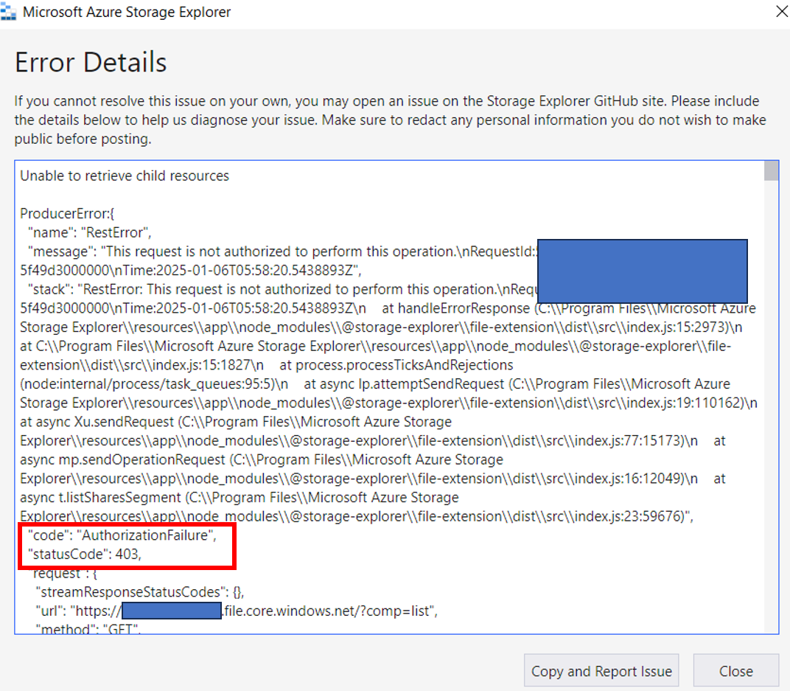
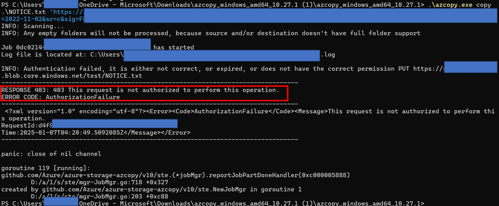
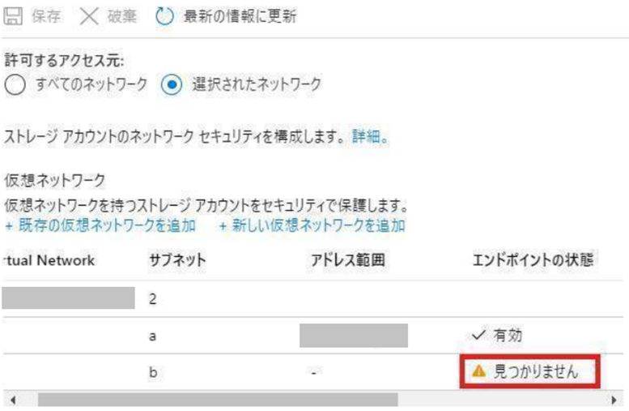

こんにちは、Azure テクニカル サポート チームの木下・富田です。  

今回は Azure ストレージ アカウント内コンテンツへのアクセス時に 403 エラー（認証エラー）が発生した場合の、対処法をストレージファイアウォール観点でエラー事例とともにご紹介いたします。  
403 エラーは認証エラーですので、ネットワークとしては疎通ができている状態ですが、認証によってアクセスが拒否されている状況となります。  
本記事ではまず、ストレージ アカウント自体に備わっているファイアウォール（ネットワーク設定）の観点でトラブルシューティングのご紹介をさせていただきます。

どれも 403 エラーや Access is denied として表示され、アクセス拒否となっていることが分かります。  
---

---

### Azure ポータルで Azure Files（ファイル共有）にアクセスした際
### Azure Storage Explorer で Azure Files（ファイル共有）にアクセスした際

### AzCopy コマンドにてファイルコピー時した際

---

---

---

### Azure Files（ファイル共有）を New-PSDrive コマンドでマウントした際

---

これらのエラーの場合は、以下の原因によりアクセス拒否となっている可能性がございます。  

- ストレージ アカウント自体に備わっているファイアウォール（ネットワーク設定）によりアクセス拒否されている
以下の手順で Azure ポータルからストレージアカウントのファイアウォールを無効化することが可能でございます。
まずは、それぞれの機能について解説させていただきます。
---
## ストレージ アカウントのファイアウォール（ネットワーク設定）とデータへの認可について

ストレージ アカウントには、特定の VNET や特定のグローバル IP アドレスからのアクセスのみを許可するといった、ファイアウォール機能が備わっております。  
こちらのファイアウォールを有効としている場合、許可されていないクライアントからの接続では上記のような 403 エラーでアクセス拒否が発生します。  

■ご参考：Azure Storage ファイアウォールおよび仮想ネットワークを構成する  
https://learn.microsoft.com/ja-jp/azure/storage/common/storage-network-security  

また、ファイアウォールで許可されたクライアントからのアクセスであっても、アクセス先のデータに対して適切な認可がされていない場合は、同様に 403 エラーのアクセス拒否が発生します。  
■ご参考：Azure Storage 内のデータへのアクセスを承認する  
以下の手順で Azure ポータルからストレージアカウントのファイアウォールを無効化することが可能でございます。

1. 対象のストレージアカウントの画面にて「ネットワーク」をクリックします。

## ストレージ アカウントのファイアウォールを一時的に無効化してみる

> [!WARNING]
---
意図せず 403 エラーでアクセス拒否となった場合、ファイアウォールによってブロックされていないかといった点を切り分けるために、一時的にファイアウォールを無効化するのが容易な手段となります。  
ファイアウォールが元から無効であったり、ファイアウォールを無効化しても 403 エラーのアクセス拒否が継続する場合は、データ認可の問題などファイアウォールとは別の原因があると判断できます。  
以下の手順で Azure ポータルからストレージアカウントのファイアウォールを無効化することが可能でございます。

1. 対象のストレージアカウントの画面にて「ネットワーク」をクリックします。
1. 対象のストレージアカウントの画面にて「ネットワーク」をクリックします。

1. 対象のストレージアカウント「ネットワーク」をクリックします。
2. 「ファイアウォールと仮想ネットワーク」より「すべてのネットワーク」を選択し「保存」します。

- [接続元クライアントが Azure VM の場合は、同一リージョンのストレージ アカウントへの接続時にプライベート IP アドレスで接続するため](https://jpaztech.github.io/blog/storage/storageFirewall-accesscontroll/)、このようなパブリック IP アドレスでの接続許可が叶いません。後述の VNET 単位の接続許可の設定をご検討ください。

「すべてのネットワーク」が選択されている状態に変更が完了したら、403 エラーのアクセス拒否が解消されるか確認してください。（少し反映までに時間がかかることもございます。）  
403 エラーのアクセス拒否が解消されていれば、ストレージファイアウォールの設定に問題があると判断できます。  

もし、このままストレージファイアウォールを無効としても運用上差し支えなければ無効の状態でご利用ください。  
アクセス元を制限したい場合は、以下に沿ってファイアウォール有効化の設定をご確認ください。  

- クライアント IP アドレスとして表示されるのは、Azure ポータルに接続している IP アドレスです。プロキシ使用時にエンドポイントへの接続をバイパスしている際などは、その点を考慮する必要がございます。

## 特定のパブリック IP アドレス（グローバル IP アドレス）からの接続を許可するようにファイアウォールを設定する

Azure ポータルにて以下の手順で、特定のパブリック IP アドレス（グローバル IP アドレス）からの接続を許可するようにファイアウォールを設定することが可能です。  

1. 対象のストレージアカウント「ネットワーク」をクリックします。
2. 「ファイアウォールと仮想ネットワーク」のクライアント端末の IP アドレスを追加し「保存」します。

パブリック IP アドレスを指定しても上手く接続できない場合は、以下の注意点についてご確認くださいませ。

- クライアント IP アドレスとして表示されるのは、Azure ポータルに接続している IP アドレスです。プロキシ使用時にエンドポイントへの接続をバイパスしている際などは、その点を考慮する必要がございます。

- クライアント IP アドレスとして表示されるのは、Azure ポータルに接続している IP アドレスです。プロキシ使用時などは、その点を考慮する必要がございます。
以下が Azure ポータルでその設定を行う手順となります。

1. 対象のストレージアカウントの画面にて「ネットワーク」をクリックします。

---
## ストレージ アカウントの診断設定およびアクセス元 IP アドレスの特定

ストレージ アカウントの診断設定を有効にすることで、ストレージにアクセスしたクライアント IP アドレスをログとして記録することが可能です。  

■ご参考：Azure Monitor の診断設定を作成する  
https://learn.microsoft.com/ja-jp/azure/azure-monitor/essentials/create-diagnostic-settings  

具体的な診断設定によるログ採取の手順例としては、Azure Files（ファイル共有）での手順について、以下の弊社ブログ記事で解説しております。  

■ご参考：Azure Files の診断設定を試す  
https://jpaztech.github.io/blog/storage/azureFilesMonitoring  

上記は、Azure Files（ファイル共有）での例とはなっておりますが、診断設定を有効にする種類として file ではなく blob を設定すれば、同様に Blob ストレージについてもアクセスログを採取することが可能です。  
採取されたログ内に callerIpAddress として、実際のアクセス元となるクライアントの IP アドレスが記録されますので、これによりアクセス元 IP アドレスの特定が可能でございます。  
---
## 特定の仮想ネットワーク（VNET）およびサブネットからのアクセスを許可する
> その場合は、一度ストレージファイアウォール「仮想ネットワーク」項目からエラーが表示されているサブネットを削除し、上述の手順で仮想ネットワークおよびサブネットの追加をお試しいただきますようお願いいたします。
ストレージ アカウントのファイアウォールでは、特定のパブリック IP アドレスからのアクセス許可でだけではなく、特定の VNET 上のサブネットからのアクセスを許可する設定をすることが可能です。  
以下がその手順となります。

1. 対象のストレージアカウント「ネットワーク」をクリックします。
2. 「ファイアウォールと仮想ネットワーク」の「仮想ネットワーク」に許可する仮想ネットワークおよびサブネットを追加します。

すでに利用したい仮想ネットワークがある場合は「既存の仮想ネットワークを追加する」から追加します。  
仮想ネットワークが未作成の場合は「新しい仮想ネットワークを追加する」より作成追加してください。  

異なるサブスクリプションの仮想ネットワークを追加する場合は、「サブスクリプション」項目のプルダウンより、対象のサブスクリプション内の仮想ネットワークおよびサブネットを選択し有効化します。  
(有効化が完了するまで最大 15 分かかる場合がございます。有効化が完了したら「追加」をクリックします。  

　 
3. 追加した仮想ネットワークおよびサブネットが表示されエンドポイントの状態が有効となっていることを確認し「保存」します。

> [!WARNING]
> ストレージファイアウォール設定で「すべてのネットワーク」と「選択されたネットワーク」の切り替えを行う場合や、登録しているサブネットが仮想ネットワーク上で一度削除され、新たに同名でサブネットが作成された場合などにより、古い情報が残存した状態となりエンドポイントの状態が「見つかりません」というようなエラーが表示されることがあります。  
>その場合は、一度ストレージファイアウォール「仮想ネットワーク」項目からエラーが表示されているサブネットを削除し、上述の手順で仮想ネットワークおよびサブネットの追加をお試しいただきますようお願いいたします。

---
## さいごに

ストレージ アカウントのファイアウォールにより許可されたクライアントから、正しく認可されたデータへアクセスがされた場合は、403 エラーのアクセス拒否は発生せず正常にアクセス可能になるものと存じます。  
403 エラーのアクセス拒否が改善せずお困りの場合は、実施されたトラブルシューティングの内容を添えて弊社 Azure 技術サポート窓口までお問い合わせいただければ、トラブルシューティングのご支援をさせていただくことも可能でございます。  

本稿が皆様のお役に立ちましたら幸いでございます。
