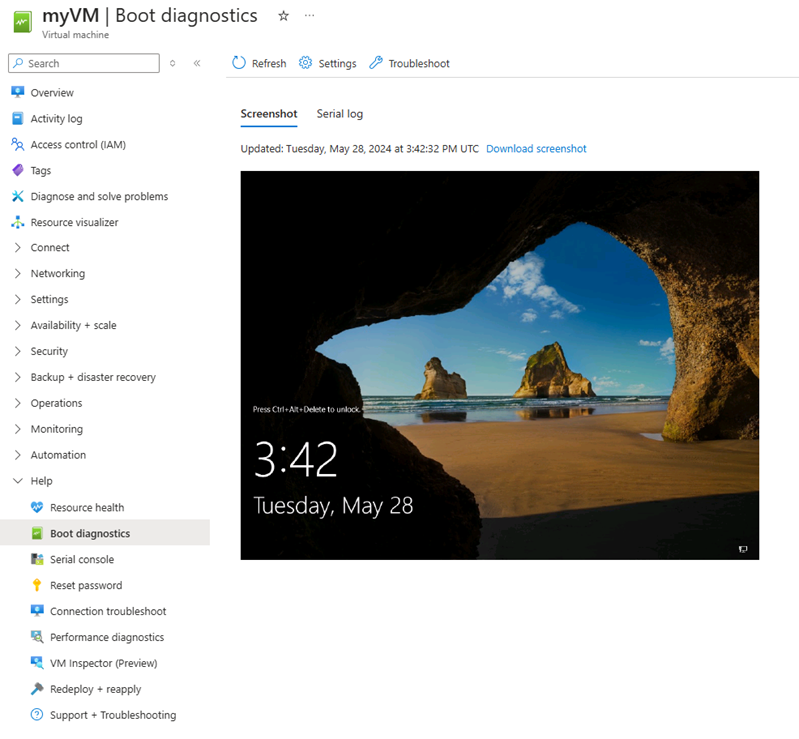
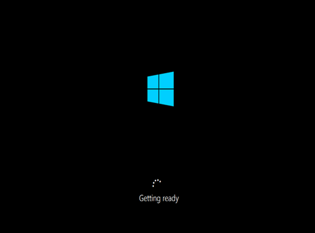
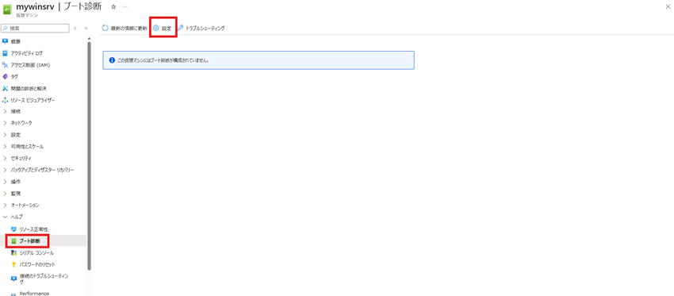
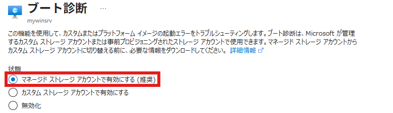
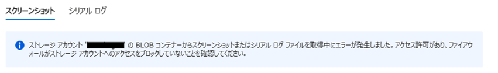
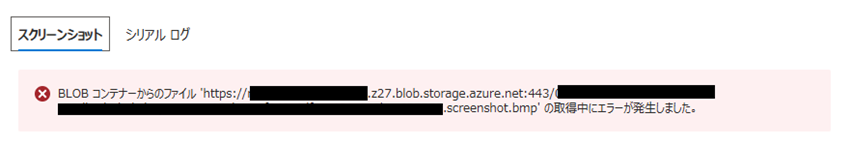

こんにちは、Azure IaaS サポートの杉野です。  
Azure VM に関する問い合わせの中でも、「VM に接続できない」、「VM が応答しない」といったトラブルは非常に多く寄せられます。

特に、Azure ポータル上では VM の状態が「実行中」と表示されているにもかかわらず、SSH や RDP で接続できないケースでは、原因の特定に時間を要することも少なくありません。  
本記事では、このような事象の切り分けに有効な「ブート診断」について、その概要と設定方法をご紹介します。

ブート診断を活用することで、ゲスト OS が起動しているかどうかを迅速に確認でき、サポートへお問い合わせいただく前の切り分けをスムーズに進めることが可能となり、復旧までの時間短縮につながるケースも少なくありません。

一方で、現場では「ブート診断を有効化していない」VM が多く、そもそも機能を利用されたことがないお客様も少なくありません。  
そのため、本記事では、ブート診断の概要と設定方法を解説します。

本記事でご紹介するブート診断に関しまして、以下の公式ドキュメントも併せてご確認いただけますと幸いでございます。

■ご参考：Azure のブート診断 - Azure Virtual Machines  
https://learn.microsoft.com/ja-jp/azure/virtual-machines/boot-diagnostics

■ご参考：Azure の VM のブート診断 - Virtual Machines  
https://learn.microsoft.com/ja-jp/troubleshoot/azure/virtual-machines/windows/boot-diagnostics

---

- [はじめに：VM に接続できないときに何が起きているのか](./#dummy)
- [ブート診断とは？](./#dummy)
- [ブート診断を有効化する方法](./#dummy)
- [【補足】カスタム ストレージ アカウント利用時の注意点](./#dummy)
- [おわりに](./#dummy)

---

## はじめに：VM に接続できないときに何が起きているのか

VM に対して SSH や RDP で接続できない場合、その原因は必ずしもネットワーク設定や認証設定とは限りません。ゲスト OS 自体が正常に起動していないケースも多く存在します。

このような状態では、Azure ポータル上では VM の状態が「実行中」と表示されるため、利用者視点では「VM は起動している」と認識されがちです。

しかし実際には、ゲスト OS が起動途中でスタックしており、外部からの接続を受け付けられない状態に陥っている場合があります。この状態は、一般に **No boot 状態**と呼ばれます。

No boot 状態に陥った場合、主に以下のような事象が確認されます。

- SSH 接続ができない / RDP 接続ができない
- Azure ポータル上では「実行中」と表示されるが、OS レベルの応答がない

No boot 状態に至る原因は多岐にわたり、代表的なものとして以下が考えられます。

- OS レベルの問題（ファイル破損、ドライバ不整合、カーネルパニックなど）
- 構成上の問題（ディスク構成ミス、ネットワーク設定不備など）
- Azure 側の要因（基盤障害、ストレージ不整合）

原因が多岐にわたるため、サポート現場では、まずブート診断のスクリーンショットやシリアル ログを確認し、OS がどこまで起動しているかを把握するところから切り分けを開始します。

これにより、接続不可の原因が OS 起動以前の問題なのか、それともネットワークや認証設定など別の要因によるものなのかを判断することが可能になります。

---

## ブート診断とは？

ブート診断は、Azure VM の起動時に出力されるコンソール情報を **スクリーンショットやログとして取得・保存する機能** です。

**対象 OS**：Windows / Linux どちらも対応  
- **Windows**：起動画面（ブートロゴ、修復モードなど）のスクリーンショット
- **Linux**：コンソールログ（カーネルメッセージ、マウント失敗など）

これにより、**「OS 起動がどこまで進んでいるか」**を視覚的・ログベースで確認することが可能となります。

正常に起動している場合、下記の通り、VM のコンソール上には **Windows のログイン画面** が表示されます。

一方で、ゲスト OS が正常に起動されていない状態の場合には、起動途中のメッセージやエラー画面のまま停止しているケースが確認されます。

表示される画面やエラー内容は状況により異なりますが、スクリーンショットから原因の絞り込みが可能な場合も多くあります。  
また、ブート診断の結果から No boot 状態が確認された場合には、No boot 観点での調査へ迅速に移行することが可能となります。

Noboot 状態のトラブルシューティングに関しましては、下記の弊社ドキュメントやブログにお纏めしておりますので必要に応じてご確認をいただけますと幸いです。

■ご参考：Azure 仮想マシンでのブート エラーのトラブルシューティング  
https://learn.microsoft.com/ja-jp/troubleshoot/azure/virtual-machines/windows/boot-error-troubleshoot

■ご参考：Azure 上の Windows OS が起動しない場合の情報まとめ  
https://jpaztech.github.io/blog/vm/windows-noboot-summary/

また、一般的なブート エラーの例については、以下のドキュメントにも整理されておりますので、こちらもご参照いただけますと幸いです。

■ご参考：Azure の VM のブート診断 - Virtual Machines  
https://learn.microsoft.com/ja-jp/troubleshoot/azure/virtual-machines/windows/boot-diagnostics#common-boot-errors

---

## ブート診断を有効化する方法

次に、Azure ポータルからブート診断を有効化する手順についてご説明します。

**1.** ブート診断を有効化する Azure VM のページより、左側 [ヘルプ] – [ブート診断] を選択します。  
※ ブート診断が設定されていない場合、「この仮想マシンにはブート診断が構成されていません。」と表示されます。

**2.** 画面上部の [設定] を選択します。

**3.** [マネージド ストレージ アカウントで有効にする] を選択し、画面下部の [適用] ボタンを押下します。  
※ お客様管理のストレージ アカウントをご利用されたい場合、[カスタム ストレージアカウント アカウントで有効にする] を選択

以上でブート診断の有効化は完了です。  
有効化後、データが利用可能になるまでしばらく時間がかかることがあります。数分後にページを更新いただき最初のデータが利用可能になるまでお待ちください。

---

## 【補足 1】カスタム ストレージ アカウント利用時の注意点

ブート診断では、お客様管理のストレージ アカウント (カスタム ストレージアカウント アカウント) を指定し、利用することも可能です。  
（上記手順 3 にて [カスタム ストレージアカウント アカウントで有効にする] を選択）

ただし、この場合は以下の点にご注意ください。

- ストレージ アカウントのファイアウォール設定により、ブート診断の画面が表示されないケースがあります

ブート診断の画面が表示されず、下記のようなメッセージを確認された場合、ストレージ アカウントのネットワーク設定を一度確認することをおすすめします。

■ご参考：Azure Storage のファイアウォール規則  
https://learn.microsoft.com/ja-jp/azure/storage/common/storage-network-security

このようにカスタム ストレージアカウント アカウントをご利用いただく場合、構成確認が必要な場合がございますため、特別な要件がない場合は**マネージド ストレージ アカウントの利用を推奨**いたします。

---

## 【補足 2】マネージド ストレージ アカウント利用時の注意点

Azure Blob Storage では、利用形態によってアクセス先の FQDN が異なります。

- **カスタム ストレージ アカウント**  
  `<storage-account>.blob.core.windows.net`

- **マネージド ストレージ アカウント**  
  `<storage-account>.z[00-50].blob.storage.azure.net`

上記の通り、マネージド ストレージ アカウントでは、通常のストレージ アカウントとは異なる FQDN が使用されます。  
そのため、Firewall やプロキシをご利用の環境において、この FQDN への通信がブロックされている場合、Azure ポータルからブート診断を確認できないことがございます。

マネージド ストレージ アカウントをご利用される際は、通常のストレージ アカウントとは異なる FQDN が使用される点について、あらかじめご留意いただけますと幸いです。

---

## おわりに

Azure VM において、「実行中」と表示されているにもかかわらず OS に接続できない場合、ゲスト OS が正常に起動していない **No boot 状態** である可能性が考えられます。

このような状況では、ブート診断を活用することで、OS の起動状況を迅速に把握でき、原因切り分けや復旧までの時間を短縮することが可能です。

特に、サポートへお問い合わせいただく際にも、ブート診断の情報があることで、初動調査をよりスムーズに進めることができます。

上述しましたようにブート診断の有効化は比較的設定も容易であり、トラブルシューティングにおいて非常に有用な機能ですので、平常時から有効化しておくことをおすすめいたします。

本記事が、障害発生時の切り分けや迅速な復旧の一助となれば幸いです。
