こんにちは、Azure テクニカル サポート チームの富田です。  
今回はきちんと理解すると意外と大変な Azure VM におけるディスクのバーストについて、  
分かりやすく解説させていただこうと思います。  
   
こちらの記事は全て弊社の公開ドキュメントの内容を解説したものとなっております。  
公開ドキュメントは複数あるため、できるだけ引用しつつ解説したいと思います。  
   
分かりやすく例を交えた結果かなり長い記事になってしまいましたが、  
きっとこちらの記事を読んでいただければ「ディスクのバースト完全に理解した。」になっていただけると思います。  
   
なお、Azure は日々凄い勢いで進化しております。  
そのため、可能な限りこの記事も最新に保ちますが、公式ドキュメントの最新の内容が正となりますので、  
必要に応じて現行の公式ドキュメントもご参考ください。  
   
また、本記事では各種の上限について数値を交えて解説しておりますが、  
こちらは理論値となっており実際の計測では OS レイヤ以上の影響もありますため、  
必ずしも記載の理論値が出ることを保証するものではございません点について予めご了承くださいませ。  
   
---
# Azure のディスクへのアクセスには「MBps」と「IOPS」の上限値があります。  

Azure VM を利用する際は、当然ディスクが必要となります。  
オンプレミス環境のサーバーや私たちが普段使用しているパソコンと同様に、Azure VM でもディスクとの通信が行われます。  
Azure ではこの VM とディスク間の通信について、「VM サイズ」と「ディスクサイズ」の両方で上限を設定しています。  
   
上限は Read / Write の合計で適用されます。  
つまり Read が 100 MBps、Write が 50 MBps 同時に発生していたら、150 MBps のディスクアクセスとして合算され、  
この合算された値に対して上限値が適用されます。
上限を超えたものは「スロットリング」（後述）が発生し、I/O の遅延となります。  
   
この通信の上限は「MBps」と「IOPS」の 2 つの設定があります。  
そして、重要な点として「VM サイズ」と「ディスクサイズ」の両方で、この上限の設定がありますが、  
この VM ディスク間の通信は「VM サイズ」と「ディスクサイズ」に設定されている低い方の上限値が適用されます。  
   
一旦、ホストキャッシュやバーストは無効と考えて、VM とデータディスク間の通信について以下に例を記載します。  
   
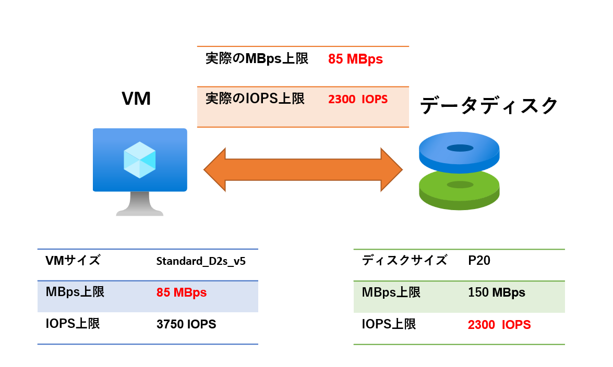 
   
上記の例では Standard_D2s_v5 の VM サイズに P20 のデータディスクのサイズを組み合わせています。  
それぞれに上限が設定されていますが、先に解説した通り低い値の方（赤字）が適用されますので、  
実際に出る速度の上限値としては  

 - 85 MBps  
 - 2300 IOPS  

となります。  
   
もう 1 つ例を見てみましょう。  
   
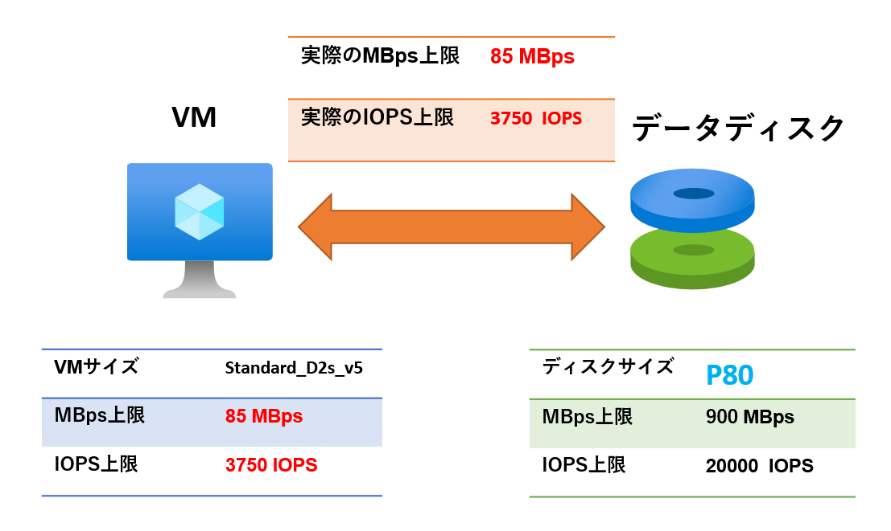
   
データディスクをとてもとても高速な P80 サイズにしました！  
しかしながら上記の通り、 VM サイズ側の上限が低い値ですので、この場合 P80
のデータディスクを接続しても、実際に出る速度の上限値としては  

 - 85 MBps  
 - 3750 IOPS

となります。  
   
折角高価で高速な P80 データディスクを接続したのにこれでは宝の持ち腐れですね。  
このようなことが無いように、「VM サイズ」と「ディスクサイズ」を両方とも適切なサイズに設定することが重要です！  
   
---
# 一時的に通信の上限を上げる「バースト」という機能があります。  

先に記載した通り、「VM サイズ」と「ディスクサイズ」それぞれに通信の上限が設定されています。  
しかしながら、特定の「VM サイズ」と「ディスクサイズ」には、この上限を一時的に上げられる「バースト」という機能がございます！  
このバーストについては「VM レベルのバースト」「ディスクレベルのバースト」という用語で記載されます。  
   
 - 「VM サイズに設定されているバーストが働くこと」＝「VM レベルのバースト」  
 - 「ディスクサイズに設定されているバーストが働くこと」＝「ディスクレベルのバースト」  

と理解していただくのが良いと思います。  
   

   
「VM レベルのバースト」と「ディスクレベルのバースト」それぞれ個別に独立して設定されてる点についてご留意ください。  
後述するクレジット消費についてもぞれぞれ個別にクレジットが存在し、消費されます。  
（この「VM レベルのバースト」と「ディスクレベルのバースト」をごっちゃになって混乱される方が非常に多いです！）  
   
後述しますがバーストは基本的に「クレジットベースのバースト」となり、自動的にバーストが発動します。  
逆に言えば、「クレジットベースのバースト」は自動的に発動するので無効にすることは叶いません。  
また、ここでのクレジットは「現金」という意味ではございませんので、  
「クレジットベースのバースト」の機能の利用について特に追加料金をいただくことなく利用できる素晴らしい機能となっております！  
（勿論、Standard HDD / SSD のトランザクション等の料金は利用に応じて発生する点はご了承ください。）  
   
P30 以上のディスクの場合は、「クレジットベースのバースト」ではなく、「オンデマンドバースト」のご利用が可能です。  
こちらも後ほど、詳細を解説させていただきます。  
   
なお、「VMレベルバースト」機能が無い VM サイズに「ディスクレベルのバースト」が有効なマネージドディスクを接続した場合は、  
「ディスクレベルのバースト」のみが働きます。（逆も然りです。）  
   
---
# 「ディスクレベルのバースト」について見てみましょう。  

それでは実際に「ディスクレベルのバースト」について、動作を例を交えて見てみましょう。  
これから 3 つの図が出てきますが、どれも Standard_D2s_v5 の VM サイズに P20 のデータディスクのサイズを組み合わせたものです。  
   
以下の例は分かりやすくするために、  

 - 「VMレベルのバースト」は無効（バーストクレジットを消費しきった状態）  
 - 「ディスクレベルのバースト」は有効（バーストクレジットがある状態）  

の状態とします。  
   
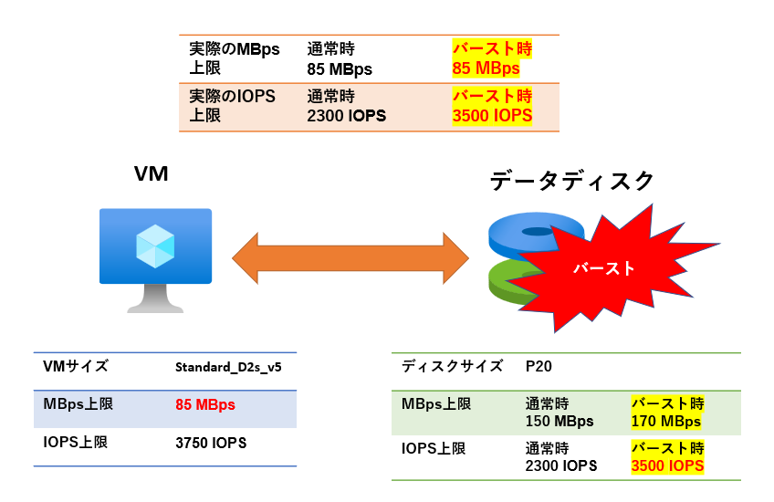
   
ディスク側の上限値がバーストで一時的に上がっていますね。  
そのため、実際の通信の上限値も一時的にバーストで向上することとなります。  
   
ただし、通常時と同じく「VMサイズ」と「ディスクサイズ」の低い方の上限が適用されますので、  
ディスクの MBps は 150 → 170 にバーストで向上していますが、  
実際の通信の上限は VM 側の上限値に引きずられて 85 MBps になります。  
   
   
   
   
---
# 「VM レベルのバースト」について見てみましょう。  

今度は「VM レベルのバースト」の方について、動作を例を交えて見てみましょう。  
以下の例は分かりやすくするために、  

 - 「VM レベルのバースト」は有効（バーストクレジットがある状態）  
 - 「ディスクレベルのバースト」は無効（バーストクレジットを消費しきった状態）  

の状態とします。  
   
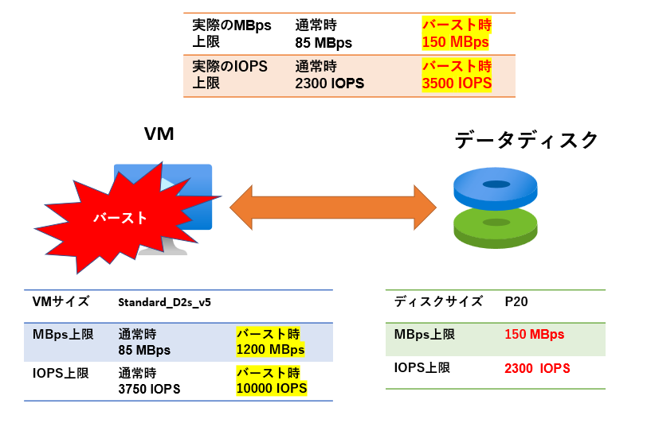
   
今度は VM 側の上限値がバーストで一時的に上がっていますね。  
そのため、こちらも実際の通信の上限も一時的にバーストで向上することとなります。  
   
ただし、通常時と同じく「VM サイズ」と「ディスクサイズ」の低い方の上限値が適用されます。  
上記の例では VM 側の上限値が大きく上がっていますが、ディスク側の上限は値そこまで大きくないので、  
ディスク側の上限に引きずられて 1500 MBps / 2300 IOPS で頭打ちしていますね。  
   
   
---
# 「ディスクレベルのバースト」と「VM レベルのバースト」両方が発動した時を見てみましょう。  

分かりやすくするために今までは、「VMレベルのバースト」と「ディスクレベルのバースト」が  
それぞれ片方づつ有効の場合の例を取り上げました。  
ですが、それぞれのバーストクレジットが残っている状況でしたら両方のバーストは同時に発動します！  
   
そのため、今回は  

 - 「VM レベルのバースト」は有効（バーストクレジットがある状態）  
 - 「ディスクレベルのバースト」も有効（バーストクレジットがある状態）  

の状態の例を見てみましょう。  
   
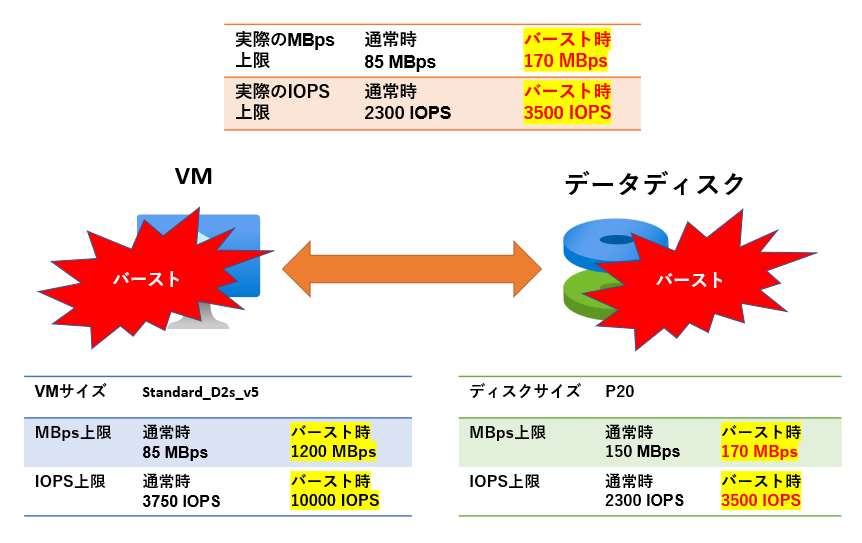
   
どちらもバーストすることで、  

 - 通常時 85 MBps → バースト時 170 MBps  
 - 通常時 2300 IOPS → バースト時 3500 IPOS  

まで向上していることが分かりますね！  
   
ただし、やはり VM 側のバースト時の上限値が大きいのに対して、ディスク側の上限値が低めのため足を引っ張っていますね。  
そのため、ディスクサイズを大きくすることで更なる性能向上が見込めることもわかるかと思います。  
   
   
---
# 公開ドキュメントから「ディスクレベルのバースト」の上限値を読み取りましょう。  

では、次にドキュメントから実際のバースト時の上限値を確認しましょう、  
まずは「ディスクレベルのバースト」から見てみましょう。  
以下のドキュメントからご確認いただくことが可能です。  
   
■ご参考: Managed Disks の価格  
<https://azure.microsoft.com/ja-jp/pricing/details/managed-disks/>  
   
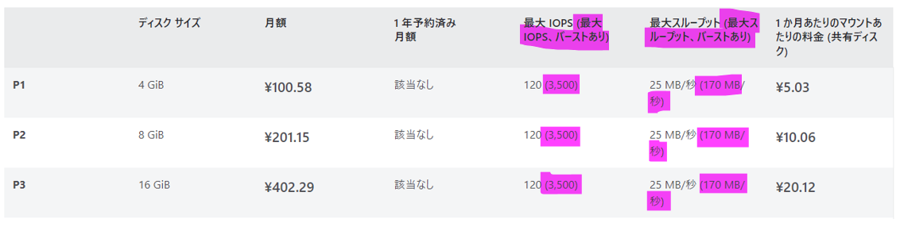
   
ハイライトした部分にバースト時の上限値が書いてありますね！  
逆にバースト時の値が書いていない VM サイズは、バーストしないということとなります。  
   
ハイライトしていない方の値はバースト無効時（クレジットを消費しきった際の最大IOPS / MBps）の値になります。  
この速度の値を「ベースパフォーマンス」とも呼びます。  
   
---
# 公開ドキュメントから「VMレベルのバースト」の上限値を読み取りましょう。  

次にドキュメントから「VMレベルのバースト」の上限値を読み取りましょう。  
こちらはちょっとややこしいので、丁寧に説明します。  
例として Dsv3 シリーズの公開資料から、「VMレベルのバースト」の上限を読み取ります。  
   
■ご参考: Dsv3 シリーズ  
<https://docs.microsoft.com/ja-jp/azure/virtual-machines/dv3-dsv3-series#dsv3-series>  
   
こちらの公開資料を見ると、4 種類のディスクパフォーマンスの上限が書いてあります。  
それぞれ、  

 - 「キャッシュが有効なマネージドディスク（および一時ディスク）」に対するアクセスか？それとも、「キャッシュ無効なディスク」に対するアクセスか？  
 - ディスクバーストは有効な状態であるか？（つまり、クレジットが残っているか？）  

の組み合わせで 4 パターンがある状態です。  
   
少し日本語表記を読み取るのが難しいので、以下に「日本語」「英語」「解説」の順に解説させていただきます。  
　# これが重要なので、解説を見てちゃんと読みとりましょう！  

|上限パターン|上限パターンA|上限パターンB|上限パターンC|上限パターンD|
|-|-|-|-|-|
|日本語ドキュメント表記|キャッシュが有効な場合および一時ストレージの最大スループットIOPS/MBps (キャッシュ サイズは GiB 単位)|バースト キャッシュが有効な一時ストレージの最大スループット: IOPS/MBps|キャッシュが無効な場合の最大ディスク スループット: IOPS/MBps|バースト キャッシュが無効なディスクの最大スループット: IOPS/MBps|
|英語ドキュメント表記|Max cached and temp storage throughput: IOPS/MBps (cache size in GiB)|Max burst cached and temp storage throughput: IOPS/MBps|Max uncached disk throughput: IOPS/MBps|Max burst uncached disk throughput: IOPS/MBps|
|解説|「キャッシュ有効なディスク」と「一時ストレージ」について、VM レベルのバーストクレジットが枯渇している時の上限値|「キャッシュ有効なディスク」と「一時ストレージ」について、VM レベルのバーストクレジットが残っている時の上限値|「キャッシュ無効なディスク」について、VM レベルのバーストクレジットが枯渇している時の上限値|「キャッシュ無効なディスク」について、VM レベルのバーストクレジットが残っている時の上限値|
  

ホストキャッシュと一時ディスクは、物理ホスト上のディスクを使用しますので、  

 - 上限パターン A と B は物理ホスト上のディスクにアクセスする際の上限値  
 - 上限パターン C と Dは物理ホストとは別にあるディスクにアクセスする際の上限値  

と読み取ることも可能です。  
なお、どれも上限値は Read / Write の合計となります。  
   
上記の表で、だいたいパターン別に上限値が分かったと思います！  
次のセクションより、この上限パターン A ～ D が具体的にどのように適用されるのかを解説します。  
   
---
# ホストキャッシュの有無でどのように上限値が適用されるのか見てみましょう。  

ホストキャッシュの有無でどのように上限値が適用されるのかが変わってきます。  
この点は以下のドキュメントで解説されています。  
   
■ご参考: 仮想マシンとディスクのパフォーマンス  
<https://docs.microsoft.com/ja-jp/azure/virtual-machines/disks-performance>  
   
ではホストキャッシュの有無でどのように上限が適用されるのか、具体的な図解と合わせて見てみましょう。  
バースト有効時も無効時もこの点の考え方は同じなので、以下のパターンについて考えます、  
   
 - アクセスパターン1: ホストキャッシュ無効なデータディスクへの Read / Write  
 - アクセスパターン2: ホストキャッシュ有効なデータディスクへの Read でキャッシュヒットした場合  
 - アクセスパターン3: ホストキャッシュ有効なデータディスクへの Read でキャッシュヒットしなかった場合  
 - アクセスパターン4: ホストキャッシュ有効なデータディスクへの Write 
 - アクセスパターン5: 一時ディスクへの Read / Write  
   
それぞれのアクセスパターンに対して、図解します。  
   
---
# アクセスパターン1: ホストキャッシュ無効なディスクへの Read / Write  

マネージドディスクの設定として、ホストキャッシュの設定が「なし」のディスクへのアクセスを考えてみましょう。  
   
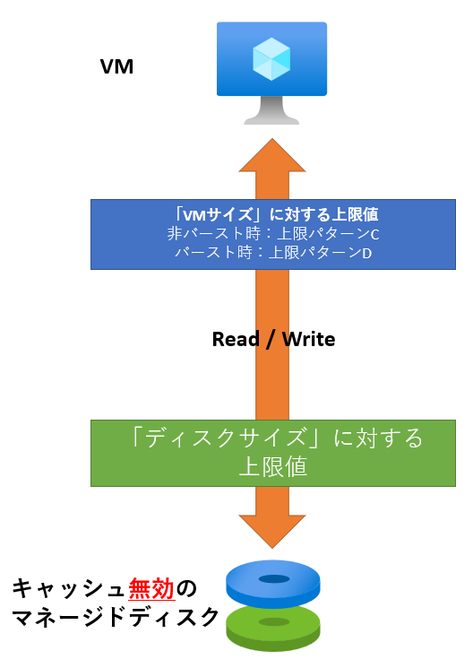
   
VM からホストキャッシュ無効なマネージドディスクへの Read / Write アクセスをした場合を考えてみましょう。  
まず VM からディスクにアクセスするのに対し「VM サイズ」で設定されている上限がありますね。  
この場合、先述の表で見ると  

 - 非バースト時：上限パターンC  
 - バースト時：上限パターンD  

の上限が適用されます。  
   
そして、加えてディスク側の上限値も適用されます。これは説明済みの内容のおさらいになりますね。  
   
---
# アクセスパターン2: ホストキャッシュ有効なディスクへの Read でキャッシュヒットした場合  

マネージドディスクの設定として、ホストキャッシュの設定が有効（「ReadOnly」または「ReadWrite」）のディスクについて、  
Read アクセスでキャッシュヒットした場合を考えてみましょう。  
   
  
   
次に、ホストキャッシュ有効のマネージドディスクに対しての Read アクセスで、  
ホストキャッシュ（物理ホスト上のディスクにあるキャッシュ）にヒットした場合を考えましょう。  
この場合、上記の図のようにホストキャッシュへのアクセスが発生しこの時に適用される上限は  

 - 非バースト時：上限パターンA  
 - バースト時：上限パターンB  

となります。  
   
また、キャッシュヒットのためマネージドディスクへのアクセスは発生しません。  
   
---
# アクセスパターン3: ホストキャッシュ有効なデータディスクへの Read でキャッシュヒットしなかった場合  

今度はマネージドディスクの設定として、ホストキャッシュの設定が有効（「ReadOnly」または「ReadWrite」）のディスクについて、  
Read アクセスでキャッシュヒットをしなかった場合について考えます。  
   
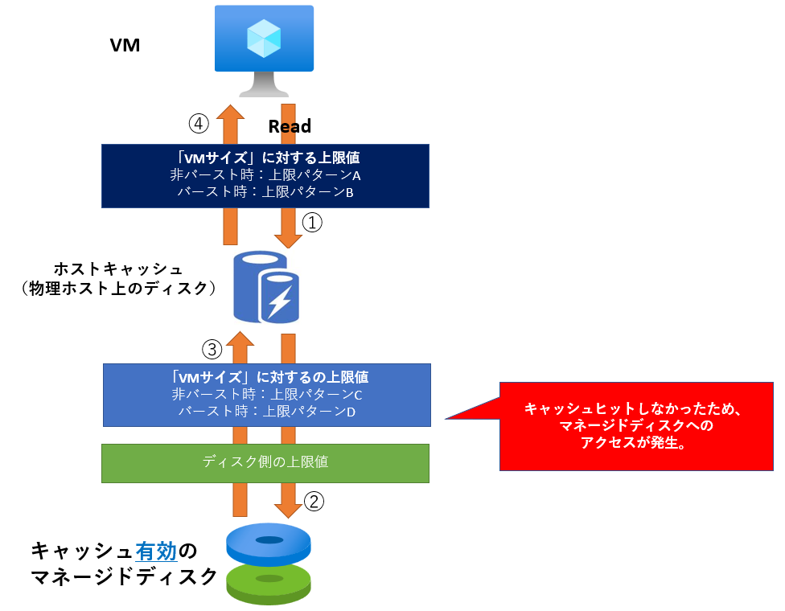
   
上記の図は実際のデータのフローとは異なる可能性がありますが、各上限値の適用についての概念として見ていただけますと幸いです。  
   
まずは、ホストキャッシュに対してヒットするか Read のリクエストがされます。（矢印①）  
キャッシュにヒットしない場合は、更にマネージドディスクへ Read のリクエストがされます。（矢印②）  
そして、マネージドディスクからホストキャッシュに対してレスポンスがされます。（矢印③）  
加えて VM に対してもレスポンスがされます。（矢印④）  
   
それぞれのアクセスの部分で、どの上限値が適用されるのかといった点は、上記の図で把握できると思います。  
   
---
# アクセスパターン4: ホストキャッシュ有効なデータディスクへの Write  

今度はマネージドディスクの設定として、ホストキャッシュの設定が有効（「ReadOnly」または「ReadWrite」）のディスクについて、  
Write を発生させて場合を考えてみます。  
   

   
ホストキャッシュに対し Write が実行されます。（矢印①）  
加えて、マネージドディスクにも Write が実行されます。（矢印②）  
   
そして、それぞれの Write 処理で適用される上限は図の通りとなります。  
ただし、ホストキャッシュの設定が「ReadOnly」と「ReadWrite」の場合で、  
この「マネージドディスクへの Write（矢印②）」が完了されるタイミングが以下のように変わってきます。  
   
## 「ReadOnly」の場合  
ホストキャッシュに対しての Write（矢印①）とマネージドディスクに対しての
Write（矢印②）の両方が完了したら、Write が完了したと見なされます。  
   
## 「ReadWrite」の場合  
ホストキャッシュに対しての Write（矢印①）が完了した時点で、Write が完了したと見なされます。  
マネージドディスクに対しての Write（矢印②）はバックグラウンドプロセスとして遅延書き込みされます。  
   
■ご参考：非キャッシュ時とキャッシュ時の仮想マシンの制限  
<https://docs.microsoft.com/ja-jp/azure/virtual-machines/isks-performance#virtual-machine-uncached-vs-cached-limits>  
   
---
# アクセスパターン5: 一時ディスクへの Read / Write  

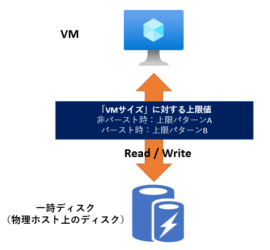
   
最後は簡単です。  
一時ディスクへのアクセスの場合は、この図の通り  

 - 非バースト時：上限パターンA  
 - バースト時：上限パターンB  

が適用されます。  
   
---
# 実際にベンチマークをして MBps や IOPS 計測してみましょう。 

ここまでの各上限の適用をおさらいするために  
「Standard_D2s_v3 サイズのVM」に対して、「キャッシュ無効なデータディスク 2 本」に  
MBps を大きくする負荷をかけて、実際にどのような値が計測されるか試してみましょう。  
なお、このデータディスク 2 本は均等に負荷がかかるように OS 上でストライピングしています。  
　  
理論値ベースでは以下の図のようになります。  
   
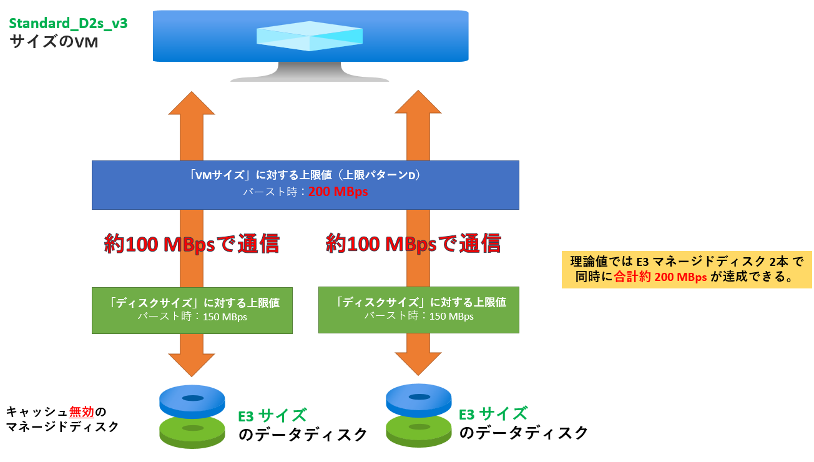
   
E3 サイズのデータディスクはバースト時 150 MBps 出ますので、2 本同時なら300 MBps が出そうです。  
しかし「Standard_D2s_v3 サイズのVM」に対する上限値として、バースト時でも200 MBps に制限されています。（上限パターン D に相当します。）  
そのため、実際には 2 本同時に 300 MBps は達成できずに実測で約 200 MBps となります。  
   
では実際にこの構成で、2 本のディスクの MBps に負荷がかかるように Write を実行するように、  
Windows 上で DiskSpd を使用してベンチマークをしてみます。
（F ドライブがストライピングした 2 つのディスクになっています。）  
   
以下がその結果です。ご覧の通り約 200 MBps を達成できていますね。  
   
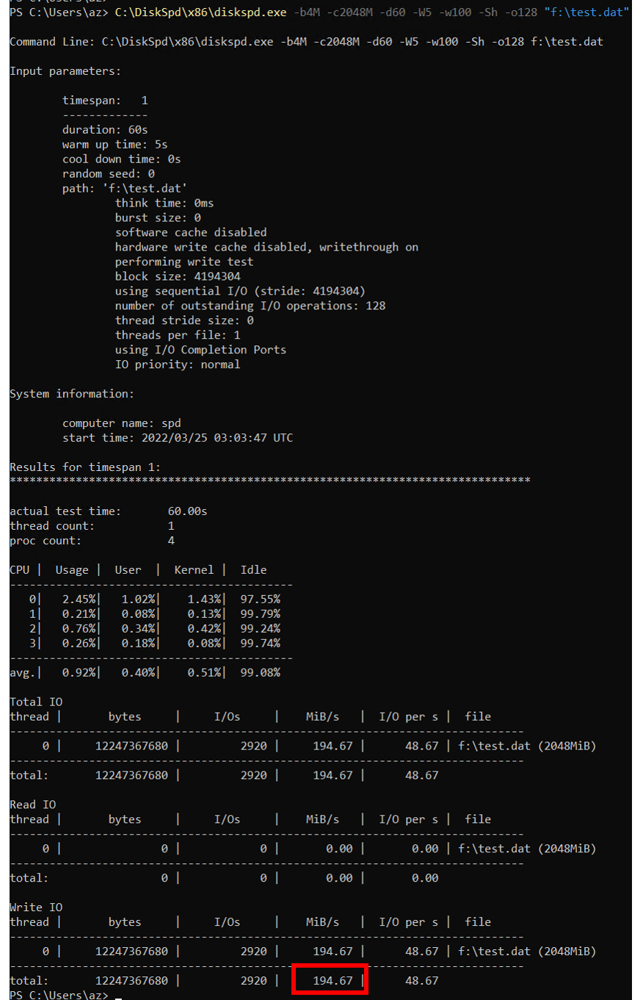 
   
なお、今回 DiskSpd の使い方自体は説明を省略させていただきますが、  
よく私が使っている DiskSpd のコマンドのサンプルを参考として記載いたしますので、適宜ご活用いただけますと幸いです。  
   
■ご参考: ディスクのベンチマークの実行  
<https://docs.microsoft.com/ja-jp/azure/virtual-machines/windows/disks-benchmarks>  
   
■ご参考: DISKSPD を使用してワークロード
ストレージのパフォーマンスをテストする  
<https://docs.microsoft.com/ja-jp/azure-stack/hci/manage/diskspd-overview>  
   

```CMD
ーーーーーサンプルーーーーー  
########################
#### MBps ベンチマーク ####
########################

# 60 秒間 Read の MBps に負荷をかける
diskspd.exe -b4M -c2048M -d60 -W5 -Sh -o128 "<ドライブレター>:\test.dat"

# 60 秒間 Read と Write に均等に MBps に負荷をかける
diskspd.exe -b4M -c2048M -d60 -W5 -w50 -Sh -o128 "<ドライブレター>:\test.dat"

# 60 秒間 Read の MBps に負荷をかける
diskspd.exe -b4M -c2048M -d60 -W5 -w100 -Sh -o128 "<ドライブレター>:\test.dat"

########################
#### IOPS ベンチマーク ####
########################

# 60 秒間 Read の IOPS に負荷をかける
diskspd.exe -c2G -b4K -F4 -r -o128 -W5 -d60 -Sh "<ドライブレター>:\test.dat"

# 60 秒間 Read と Write に均等に IOPS に負荷をかける
diskspd.exe -c2G -b4K -F4 -r -o128 -W5 -d60 -w50 -Sh "<ドライブレター>:\test.dat"

# 60 秒間 Write の IOPS に負荷をかける
diskspd.exe -c2G -b4K -F4 -r -o128 -W5 -d60 -w100 -Sh "<ドライブレター>:\test.dat"
ーーーーーーーーーーーーーー  
```

余談とはなりますが、「上記のベンチマークで期待した速度は出るのに、実際のワークロードで期待した速度が出ない！」といった場合は、  
Azure 基盤側の異常等は発生しておらず、OS 上のデータ側の問題（断片化等）や、  
お使いのソフトウェアが性能を使い切れていない可能性があるといった切り分けができますね。  
   
   
---
# 一時ディスクとキャッシュ無しのマネージドディスク両方同時に負荷をかけてみましょう。  

今度は、VM レベルの上限値への理解を深めるため、  
「キャッシュ無しのマネージドディスク」と「一時ディスク」に同時にをかけて、どれくらいの速度が出るのか試してみましょう。  
   
VM レベルで設定されている、  
「キャッシュ無しのマネージドディスク」と「一時ディスク」に対する上限値は別々に独立して設定されていていることに注意しましょう。  
先の例で表すと、  

 - 「キャッシュ無しのマネージドディスク」に対する上限は「上限パターンD」  
 - 「一時ディスク」に対する上限は「上限パターンB」  

で、それぞれ別に設定されているため、それぞれ独立して上限が適用されます。  
以下の図を見てみましょう。  
   
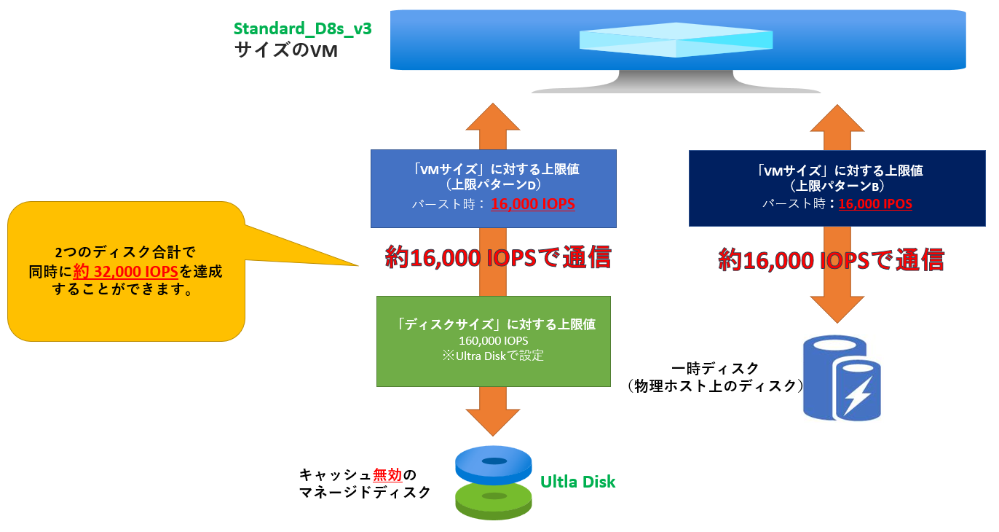 
   
今回、Standard_D8s_v3 サイズを例にとると、上限パターンB と上限パターンD
がたまたま同じ 16,000 IOPS ですが、それぞれ個別に存在しています。  
そのため、同時に「キャッシュ無しのマネージドディスク」と「一時ディスク」に負荷をかけた際は合計で  
約 32,000 IOPS が達成できます。  
   
この点は以下のドキュメントに記載されております。  
   
■ご参考：ストレージ IO メトリックの例  
<https://docs.microsoft.com/ja-jp/azure/virtual-machines/disks-metrics#storage-io-metrics-example>  
   
   
---
# 公開ドキュメントに「VM レベル」のディスク通信の上限値が記載されていないパターンがあります。  

「VM レベル」の上限について公開ドキュメントを見ていると、  
探している「VM レベル」のディスクの上限のパターンが記載されていないといった場合がございます。  
   
例えば先の例の Dsv3 シリーズの公開資料こちらの公開資料を見ると、  
以下の通り 4 種類のディスクパフォーマンスの上限が網羅されています。   
   
■ご参考: Dsv3 シリーズ  
<https://docs.microsoft.com/ja-jp/azure/virtual-machines/dv3-dsv3-series#dsv3-series>  
   

|上限パターン|上限パターンA|上限パターンB|上限パターンC|上限パターンD|
|-|-|-|-|-|
|日本語ドキュメント表記|キャッシュが有効な場合および一時ストレージの最大スループットIOPS/MBps (キャッシュ サイズは GiB 単位)|バースト キャッシュが有効な一時ストレージの最大スループット: IOPS/MBps|キャッシュが無効な場合の最大ディスク スループット: IOPS/MBps|バースト キャッシュが無効なディスクの最大スループット: IOPS/MBps|
|英語ドキュメント表記|Max cached and temp storage throughput: IOPS/MBps (cache size in GiB)|Max burst cached and temp storage throughput: IOPS/MBps|Max uncached disk throughput: IOPS/MBps|Max burst uncached disk throughput: IOPS/MBps|
|解説|「キャッシュ有効なディスク」と「一時ストレージ」について、VM レベルのバーストクレジットが枯渇している時の上限値|「キャッシュ有効なディスク」と「一時ストレージ」について、VM レベルのバーストクレジットが残っている時の上限値|「キャッシュ無効なディスク」について、VM レベルのバーストクレジットが枯渇している時の上限値|「キャッシュ無効なディスク」について、VM レベルのバーストクレジットが残っている時の上限値|
   

他方、一例としてDadsv5 シリーズでは以下のような記載にとどまっています。  
   
■ご参考: Dadsv5 シリーズ  
<https://docs.microsoft.com/ja-jp/azure/virtual-machines/dasv5-dadsv5-series#dadsv5-series>  
   

|上限パターン|上限パターンE|上限パターンC|上限パターンD|
|-|-|-|-|
|日本語ドキュメント表記|一時ストレージの最大スループット: IOPS/MBps|キャッシュが無効な場合の最大ディスク スループット: IOPS/MBps|バースト キャッシュが無効なディスクの最大スループット: IOPS/MBps|
|英語ドキュメント表記|Max temp storage throughput: IOPS/MBps|Max uncached disk throughput: IOPS/MBps|Max burst uncached disk throughput: IOPS/MBps|
|解説|「一時ストレージ」についての上限スループット（※「一時ストレージ」についてはVM レベルのバーストの設定は無い）|「キャッシュ無効なディスク」について、VM レベルのバーストクレジットが枯渇している時の上限値|「キャッシュ無効なディスク」について、VM レベルのバーストクレジットが残っている時の上限値|
   

Dsv3 の「上限パターンA・B」に相当するキャッシュ有効なディスクへのスループットが記載されていませんね。  
では「上限パターンA・B」に相当するキャッシュ有効なディスクへのスループットの上限値等はどうなっているかと言うと、恐縮ながら非公開であるとなります。  
なお、「上限パターンA・B」に相当するキャッシュ有効なディスクへのスループットの上限値は非公開ですが、  
キャッシュ有効なディスクの接続をしてご利用いただくこと自体は可能です。  
   
   
---
# ディスクレベルの「クレジットベースのバースト」と「オンデマンドバースト」について  

ディスクレベルのバーストをかける方法として「クレジットベースのバースト」と「オンデマンドバースト」の 2 種類の方法があります。  
   
「クレジットベースのバースト」はバーストをしていない状態の間にクレジット（現金ではありません。）を貯めておき、  
バースト時にクレジットを消費するといった方式です。  
   
なお、この「クレジットベースのバースト」は無効にすることはできません。  
「クレジットベースのバースト」が使用可能な、ディスクサイズ・VM サイズをご利用の場合は自動的に有効となります。  
しかしながら、「クレジットベースのバースト」の利用について特に追加料金をいただくことなく利用できます。  
（勿論、Standard HDD / SSD のトランザクション等の料金は利用に応じて発生する点はご了承ください。）  
   
一方、「オンデマンドバースト」は既定で無効であり、お客様より手動で有効に設定いただくものとなっております。  
無効である場合はバーストは発生しません。有効となっている状態の場合にバーストが発生可能です。  
本記事では「オンデマンドバースト」についての詳細な説明は省略させていただきますので、  
必要に応じて以下の公開ドキュメントをご参照くださいませ。  
   
■ご参考: オンデマンド バースト  
<https://docs.microsoft.com/ja-jp/azure/virtual-machines/disk-bursting#on-demand-bursting>  
   
なお、記事執筆時点では「クレジットベースのバースト」と「オンデマンドバースト」は以下のように、使用可能なディスクサイズが設定されています。  
下記の表の通り、同じディスクサイズで「クレジットベースのバースト」と「オンデマンドバースト」の併用はできない形になっております。  

|ディスクサイズ|クレジットベースのバースト|オンデマンド バースト|
|-|-|-|
|P30 以上のPremium SSD|不可|利用可能です|
|P20 以下のPremium SSD|利用可能です|不可|
|E40 以上のStandard SSD|不可|不可|
|E30 以下のStandard SSD|利用可能です|不可|
|全てのStandard HDD|不可|不可|


   
---
# VM レベルの「クレジットベースのバースト」について  

また、VM レベルのバーストに関しては「クレジットベースのバースト」のみ有効です。  
VM レベルの「オンデマンド バースト」機能はございません。  
VM レベルの「クレジットベースのバースト」が有効である VM サイズは各 VM シリーズの説明のドキュメントをご参照ください。  
   
■ご参考: Azure の仮想マシンのサイズ  
<https://docs.microsoft.com/ja-jp/azure/virtual-machines/sizes>  
   
例えばですが、Dadsv5 シリーズでは以下のように VM レベルの「クレジットベースのバースト」が有効である旨が記載されていますね。  
   
■ご参考: Dadsv5 シリーズ  
<https://docs.microsoft.com/ja-jp/azure/virtual-machines/dasv5-dadsv5-series#dadsv5-series>  
   
>ーーーーー抜粋ーーーーー  
>Dadsv5 シリーズの VM
>では、ディスクのパフォーマンスをバーストでき、一度に最大 30
>分間バーストを最大にしておくことができます。  
>ーーーーーーーーーーーー  
   
---
# バーストクレジットについての基本の考え方  

バーストクレジットについては  

 - ディスクレベルの MBps のバーストクレジット  
 - ディスクレベルの IOPS のバーストクレジット  
 - VM レベルの MBps のバーストクレジット  
 - VM レベルの IOPS のバーストクレジット  

がそれぞれ 4 種類、独立して存在しています。  
   
つまり、VM レベルの MBps のバーストを使用していたとしても、他の 3 つの部分がバーストを使用していなければ、  
消費されるのは「VM レベルの MBps のバーストクレジット」だけです。  
   
■ご参考：バースティングの状態  
<https://docs.microsoft.com/ja-jp/azure/virtual-machines/disk-bursting#bursting-states>  
   
バーストクレジットの消費と蓄積について説明します。  
以下の図では「ディスクレベルの MBps のバーストクレジット」を例としていますが、  
VM レベルのディスクバーストクレジットを含め上記 4 種のクレジットどれも考え方は同じとなります。  
   
■ご参考：バースティングのフロー  
<https://docs.microsoft.com/ja-jp/azure/virtual-machines/disk-bursting#bursting-flow>  
   
>ーーーーー抜粋ーーーーー  
>バーストのクレジット システムは、VM レベルとディスクレベルの両方で同様に適用されます。  
>ーーーーーーーーーーーー  
   
## バーストクレジットの消費と蓄積についての原則  
 - 初回はクレジットは満タンの状態から開始されます。  
 - VM 割り当て解除後に再度 VM を起動し物理ホストが変更となることでクレジットはリセットされ満タンとなります。  
 - 一方、ポータルや OS 上からの再起動では物理ホストが変更されないためクレジットはリセットされません。  
 - 満タンに溜まっている状態の場合は、バースト時の最大値を連続して 30 分利用可能となります。  
 - ベースラインパフォーマンスを超えた分だけ、バーストクレジットが消費されます。  
 - ベースラインパフォーマンスより低い分だけ、バーストクレジットが蓄積されます。  
   
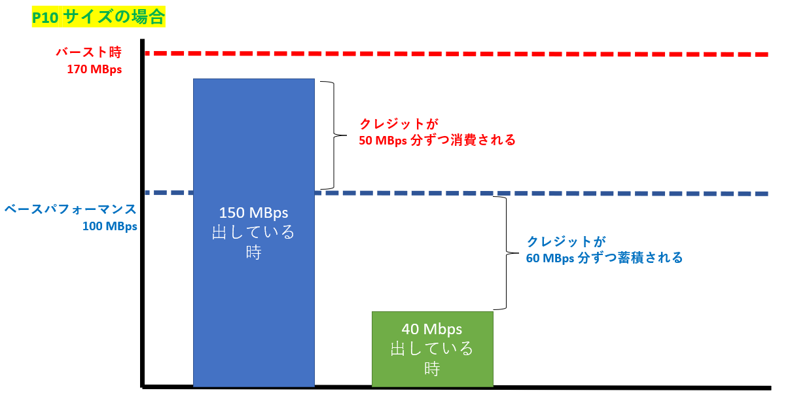
   

■ご参考：バースティングのフロー  
<https://docs.microsoft.com/ja-jp/azure/virtual-machines/disk-bursting#bursting-flow>  
   
この説明だけだと、少しイメージし辛いと思いますのでここでクレジットの蓄積と消費について例を交えて見てみましょう。  
   
例として、P10ディスクの MBps で考えてみまます。  
P10ディスクは  

 - 非バースト時（ベースライン パフォーマンス）：100 MBps  
 - バースト時：170 MBps  

となっています。  
   
この際に以下の 3 パターンでクレジットがどう変動するか解説します。  
なお以下の値は理論値ですので、実際には綺麗にこの状態を再現するのは難しく、
あくまで参考として感だえていただけますと幸いです。
   
---
# バーストクレジットの消費と蓄積の例 1  

>【例1】  
・クレジット満タンでスタート  
　↓  
・30 分間 170 MBps で通信  
　↓  
・21 分間 0 MBps で通信  
   

計算式が出て少し複雑そうに見えるのですが、理論としてはそこまで難しいものではありませんので、順を追って確認しましょう。  
   
まず、P10ディスクは  

 - 非バースト時（ベースライン パフォーマンス）：100 MBps  
 - バースト時：170 MBps  

となっています。  
この「ベースライン パフォーマンス」が重要になってきます。  
   
バースト時にクレジットが消費されるのは、ベースラインパフォーマンスを超えた分だけです。  
つまり P10 の例だと最大で 170 MBps が出ている間は、 170 -100 = 70 MBps
がクレジットとして消費されるものとなります。  
   
また、クレジットは最大でも「30 分間バースト最大値」が出る量までしか溜まりません。  
「70 MBps」分だけベースパフォーマンスよりもバーストしている状態が「30分」持続することができるということです。  
   
Azure ではクレジットの量を基本的にパーセンテージで表記しています。  
しかしながら、今回説明をわかりやすくするために、このクレジットが満タンの際のクレジットの絶対量を以下のように表してみます。  
   
>式：  
「ベースパフォーマンスより超えてバースト可能なMBps」×「1800（30分を秒に直した値）」＝「クレジットの最大絶対量（Mbps-Credit）」  
 

>P10 ディスクでの例：  
70 × 1800 = 126000 MBps-Credit  
   

この Mbps-Credit は、全く正式な単位でも Azure の語句でもございません。  
解説を分かりやすくするために、このように表記をさせていただきます。  
   
満タンの状態からこの 126000 Mbps-Credit を消費していくこととなります。  
170 MBps で通信した場合は、ベースを超えた分、毎秒 70 Mbps-Credit ずつクレジットを消費していきます。  
   
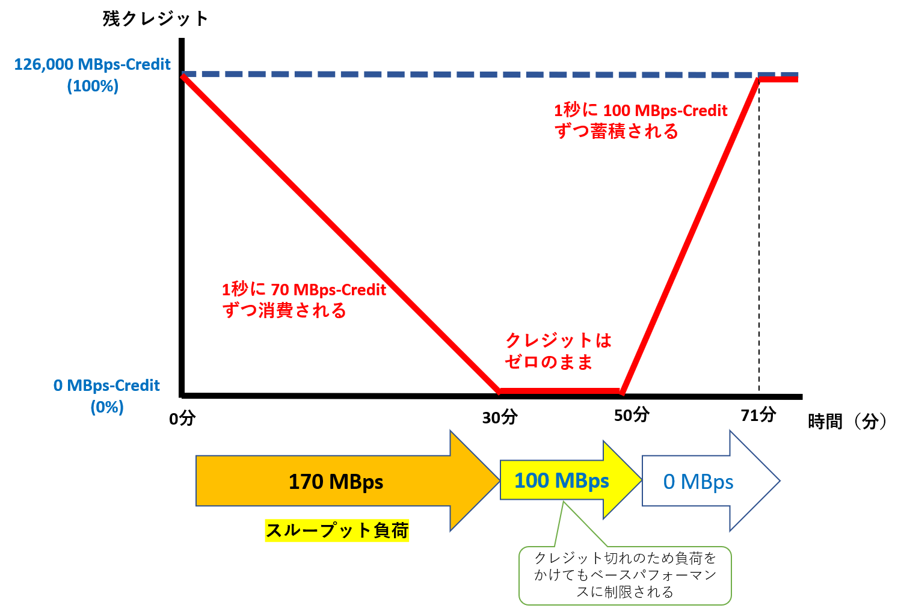
   
上記のグラフを例に見てみましょう。  
170 MBps で 30 分ディスクに負荷をかけると、毎秒 70 Mbps-Credit ずつ消費され、30 分後にクレジットが底をつきます。  
クレジットが無い状態では、どんなに負荷をかけてもベースパフォーマンス（100 MBps）しか出ません。  
   
そして、50 分が経過したタイミングディスクへの負荷をゼロ（0 MBps）にします。そうすると、今度はクレジットの蓄積が始まります。  
蓄積されるクレジットの量は「ベースラインパフォーマンスより低い分だけ」ですので、今回は毎秒 100 MBps-Credit ずつクレジットが溜まっていきます。  
21分（1260秒）後には、満タンの 126000 Mbps-Credit になりますね。  
   
---
# バーストクレジットの消費と蓄積の例 2  

>【例2】  
・クレジット満タンでスタート  
　↓  
・15 分間 170 MBps で通信  
　↓  
・15 分間 100 MBps で通信  
 

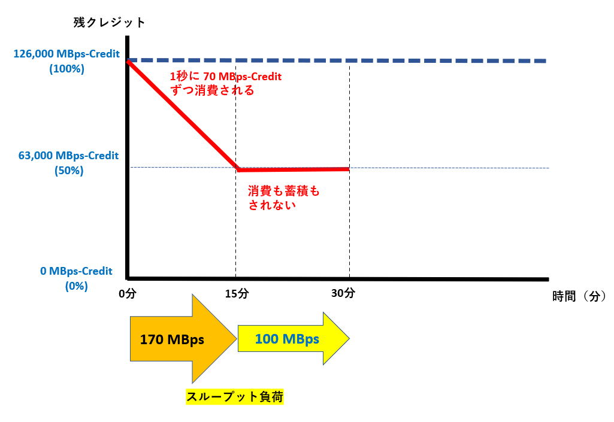
   
次に上記の例を見てみましょう。  
15 分間 170 MBps で負荷をかけてみます。15 分後には 50 %のクレジットを消費したことになります。  
   
そして 15～30 分にはピッタリ 100 MBps の負荷をかけてみます。  
この速度は、ピッタリ P10 サイズのベースパフォーマンスですので、クレジットは消費も蓄積もされない状態となります。  
   
---
# バーストクレジットの消費と蓄積の例 3  

>【例3】  
・クレジット満タンでスタート  
　↓  
・60 分間 135 MBps で通信  
　↓  
・42 分間 50 MBps で通信  
 

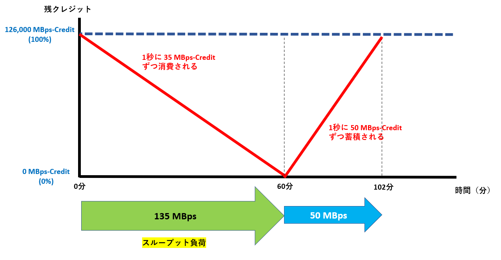
   
最後のパターンです！ちょっと微妙な量の負荷をかけてみたパターンとなります。  
まず、60 分間 135 MBps の負荷をかけてみます。  
   
ベースパフォーマンスを超えてバーストしている量は 135 - 100 = 35 MBps ですね。
そのため、毎秒 35 MBps-Credit ずつ消費されていきます。  
このペースでクレジットを消費すると、60 分後にクレジットが底をつきます。  
   
その後、50 MBps のディスク負荷をかけてみましょう。  
今度はペースパフォーマンスの 100 MBps よりも低いので、ベースパフォーマンスより低い分だけ少しずつクレジットが溜まっていきます。  
具体的にはベースパフォーマンスより 50 MBps 低いですので、毎秒 50 MBps-Credit ずつ蓄積されていきます。  
そして、このペースで蓄積すると 42 分（2540秒）後にはクレジットが満タン（126000 MBps-Credit）になります。  
   
これでクレジットの消費と蓄積について、理解できたとかと思います！   
   
---
# ディスクバースト関連するメトリックを見てみましょう。  
   
それでは、これから実際に  

 - クレジットの残りがどれくらいか？  
 - 上限値に対してどの程度の通信速度が出ているか？  
 - どれくらいの MBps / IOPS の値が出ているか？  

という点について、Azure ポータルのメトリックより確認してみましょう。  
なお、各値については Azure 基盤上で観測できた値となりますため、OS 上で観測した値と差異があることもございます点、予めご了承ください。  
   
メトリックを見る際は以下のように、Azure ポータルで対象の VM の画面より「メトリック」のブレードを選択いただくことでメトリック表示画面になります。  
   
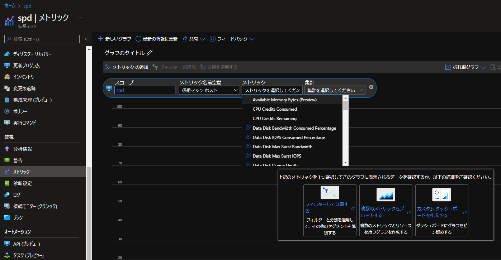
   
今回メトリックの表示の仕方の詳細は省略させていただきます。  
メトリックの表示自体の詳細が知りたい場合は、以下の公開ドキュメントをご参照ください。  
   
■ご参考: Azure Monitor メトリックの概要  
<https://docs.microsoft.com/ja-jp/azure/azure-monitor/essentials/data-platform-metrics>  
   
■ご参考：Azure Monitor のサポートされるメトリック  
<https://docs.microsoft.com/ja-jp/azure/azure-monitor/essentials/metrics-supported>  
   
それでは、ディスクバーストに関連するメトリックとして、今回は一気に以下の 21 種類のメトリックについて紹介いたします。  
自身が確認したいメトリックはどれであるかを把握しましょう。  
   
## ・ディスクレベルのバーストのクレジットの残りがどれくらいか？  
 - メトリック1：OS ディスクに関してディスクレベルの MBps の残クレジットを確認  
 - メトリック2：OS ディスクに関してディスクレベルの IOPS の残クレジットを確認  
 - メトリック3：データディスクに関してディスクレベルの MBps の残クレジットを確認  
 - メトリック4：データディスクに関してディスクレベルの IOPS の残クレジットを確認  

## ・VM レベルのバーストのクレジットの残りがどれくらいか？  
 - メトリック5：VM レベルのディスクバーストの MBps / IOPS 残クレジットを確認  

## ・ディスクレベルのベースパフォーマンスに対して何 % 出ているか確認  
 - メトリック6：OS ディスクに関してディスクレベルの MBps のベースパフォーマンスの何 % 出ているか確認  
 - メトリック7：OS ディスクに関してディスクレベルの IOPS のベースパフォーマンスの何 % 出ているか確認  
 - メトリック8：データディスクに関してディスクレベルの MBps のベースパフォーマンスの何 % 出ているか確認  
 - メトリック9：データディスクに関してディスクレベルの IOPS のベースパフォーマンスの何 % 出ているか確認  

## ・VM レベルのベースパフォーマンスに対して何 % 出ているか？  
 - メトリック10：キャッシュ有効なディスクに対して VM レベルの MBps のベースパフォーマンスの何 % 出ているか確認  
 - メトリック11：キャッシュ有効なディスクに対して VM レベルの IOSP のベースパフォーマンスの何 % 出ているか確認  
 - メトリック12：キャッシュが無効なディスクに対して VM レベルの MBps のベースパフォーマンスの何 % 出ているか確認  
 - メトリック13：キャッシュが無効なディスクに対して VM レベルの IOSP のベースパフォーマンスの何 %出ているか確認  

## ・どれくらいの MBps / IOPS が出ているか？  
 - メトリック14：OS ディスクの Read が何 MBps 出ているか確認  
 - メトリック15：OS ディスクの Write が何 MBps 出ているか確認  
 - メトリック16：OS ディスクの Read が何 IOPS 出ているか確認  
 - メトリック17：OS ディスクの Write が何 IOPS 出ているか確認  
 - メトリック18：データディスクの Read が何 MBps 出ているか確認  
 - メトリック19：データディスクの Write が何 MBps 出ているか確認  
 - メトリック20：データディスクの Read が何 IOPS 出ているか確認  
 - メトリック21：データディスクの Write が何 IOPS 出ているか確認  
   
---
# データディスクのメトリック表示について  

各メトリックを紹介する前に、各データディスクのメトリック表示をどうやって表示するかにについて先に説明いたします。  
   
データディスクは 1 つの VM に複数個アタッチできます。  
そのためデータディスクのメトリックでは、既定では全データディスクの値が混ざった状態で表示されてしまいます。  
   
各データディスク毎にメトリックを確認したい場合は、  
ディメンションでデータディスクの LUN 番号を分割することで各データディスク毎の情報を表示できます。  
   
まず以下のように VM のディスクブレードからデータディスクの LUN 番号を確認しましょう。  
   

   
そして、メトリック画面でディメンションを LUN で分割すると、各データディスク毎のメトリックの表示が可能になります。  
以下の図では 2 つのデータディスクの情報がそれぞれ表示されていますね。  
   
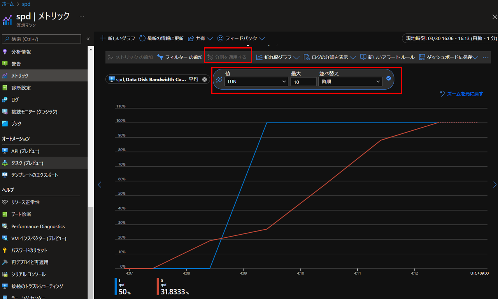
   
また、LUN でフィルターをすることで、特定のデータディスクのみ表示することも可能です。  
   
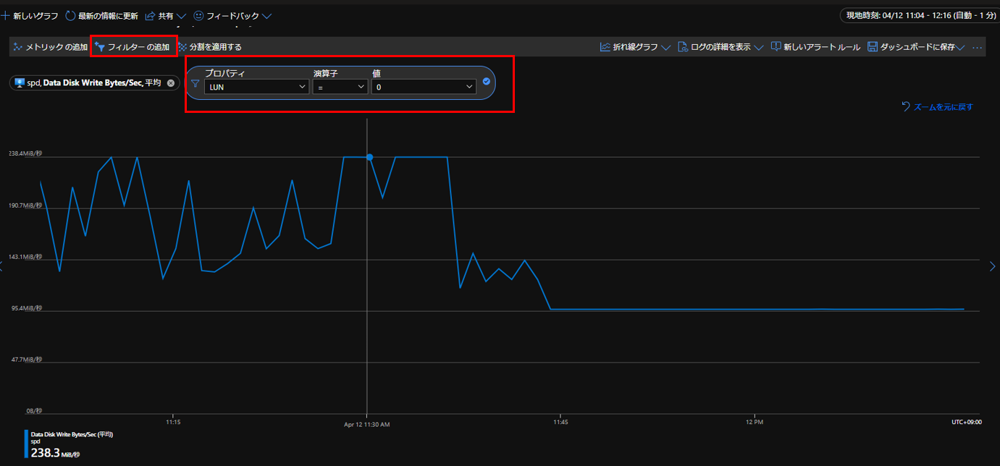 
   
---
# ディスクレベルのバーストのクレジットの残りがどれくらいか？  

ディスクレベルのバーストについて、「各ディスクのクレジットがどれくらい残っているか？」  
について、メトリックから確認してみましょう。  
   
なお、残りクレジットの量はパーセンテージでしか表示が叶いません。  
また、以下の各メトリックは「何 % クレジットを消費したか？」というものとなりますので、  
「0 % はクレジット満タン」「100 % はクレジット枯渇」となりますので、ご注意ください。  
   
 - メトリック1：OS ディスクに関してディスクレベルの MBps の残クレジットを確認  
→メトリック「OS Disk Used Burst BPS Credits Percentage」を選択します。  
   
以下にグラフの一例を出します。「0 % はクレジット満タン」「100 % はクレジット枯渇」となります。  
つまり、以下のグラフはディスクに負荷をかけてクレジットが消費され、その後ディスク負荷が無くなりクレジットが蓄積されていってることがわかりますね。  
   
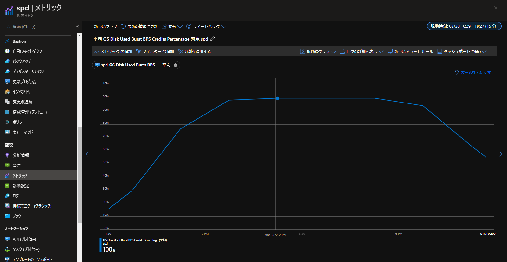
   
以下、見方は同じなので説明は割愛させていただきます。  
なおデータディスクについては先に説明した通り、必要に応じて LUN でディメンション分割をしてください。  
   
 - メトリック2：OS ディスクに関してディスクレベルの IOPS の残クレジットを確認  
   - メトリック「OS Disk Used Burst IO Credits Percentage」を選択します。  
  

 - メトリック3：データディスクに関してディスクレベルの MBps の残クレジットを確認  
   - メトリック「Data Disk Used Burst BPS Credits Percentage」を選択します。  
  

 - メトリック4：データディスクに関してディスクレベルの IOPS の残クレジットを確認  
   - メトリック「Data Disk Used Burst IO Credits Percentage」を選択します。  
   
   
---
# VM レベルのバーストのクレジットの残りがどれくらいか？  

 - メトリック5：VM レベルのディスクバーストの MBps / IOPS 残クレジットを確認  
   
記事の都合上期待させるような書き方になって恐縮なのですが、  
結論から申し上げますと「VM レベルのバーストのクレジットの残りがどれくらいか？」は確認することが叶いません。  
   
そのため、後述の  
　【どれくらいの MBps / IOPS が出ているか？】  
というメトリックを用いて、ディスク負荷をかけている際に  

 - ベースパフォーマンス以上が出ている＝クレジットが残っている  
 - ベースパフォーマンスで頭打ちしている＝クレジットが枯渇した可能性がある  

と考えて見ていただく必要があります。  
   
勿論、ベースパフォーマンス付近での頭打ちが他の要因で起きている可能性もあります点はご注意ください。  
   
---
# ディスクレベルのベースパフォーマンスに対して何 % 出ているか？  
   
ディスクレベルの上限値があることは既にご説明の通りです。  
既に例を出していますが P10 ディスクの MBps で考えてみましょう。  

P10 ディスクは  

 - 非バースト時（ベースパフォーマンス）：100 MBps  
 - バースト時：170 MBps  

といったディスクレベルの上限が設定されていますね。  

この際、「非バースト時（ベースパフォーマンス）を 100 %」としてどの程度の MBps / IOPS が発生していたか？  
という点をメトリックで確認できます。  
バースト時の上限を 100 % としないことに注意してください。  
   
つまり P10 ディスクの場合  
 - 100 Mbps 出ていれば、100 % と表示されます。  
 - 50 Mbps 出ていれば、50 % と表示されます。  
 - 170 MBps 出ていても、このメトリックでは 100 % と表示されます。  

以下は、P10 ディスクの MBps に負荷をかけた例のメトリックとなります。  
上部のメトリックは、「Data Disk Write Bytes/Sec 」つまり速度の実測値です。  
下部のメトリックは、「Data Disk Bandwidth Consumed Percentage」つまりディスクレベルの上限に対してのパーセンテージのメトリックです。  
時間軸は同じで並べています。  
   
上部のメトリックを見ると、最初は P10 サイズのディスクがバーストして 170 MBps を出していますが、クレジットが枯渇し途中から、  
ベースパフォーマンスの 100 MBps になっていることが分かるかと思います。  
   
そして、下部のメトリックを見ると  
170 MBps でも 100 MBps でも下部の「Data Disk Bandwidth Consumed Percentage」は 100 % になっていることを確認できますね。  
   
[](./disk-burst/image25.png)
   
それでは、具体的なメトリック名を紹介していきます。  
データディスクについては、必要に応じて LUN でディメンション分割をしてください。  
   
 - メトリック6：OS ディスクに関してディスクレベルの MBps のベースパフォーマンスの何 % 出ているか確認  
   - メトリック「OS Disk Bandwidth Consumed Percentage」を選択します。  
  

 - メトリック7：OS ディスクに関してディスクレベルの IOPS のベースパフォーマンスの何 % 出ているか確認  
   - メトリック「OS Disk IOPS Consumed Percentage」を選択します。  
  

 - メトリック8：データディスクに関してディスクレベルの MBps のベースパフォーマンスの何 % 出ているか確認  
   - メトリック「Data Disk Bandwidth Consumed Percentage」を選択します。  
  

 - メトリック9：データディスクに関してディスクレベルの IOPS のベースパフォーマンスの何 % 出ているか確認  
   - メトリック「Data Disk IOPS Consumed Percentage」を選択します。  

   
なお、これらのメトリックに関しては以下の点もご注意ください。  
   
■ご参考：ストレージ IO 使用率メトリック  
<https://docs.microsoft.com/ja-jp/azure/virtual-machines/disks-metrics#storage-io-utilization-metrics>  
   
>ーーーーー抜粋ーーーーー  
>Premium ストレージをサポートする VM シリーズ上でのみ使用できます。  
>Ultra ディスクには使用できません。これらの VM シリーズ上の他のディスクの種類には、いずれもこれらのメトリックを使用できます。  
>ーーーーーーーーーーーー  
   
   
---
# VM レベルのベースパフォーマンスのに対して何 % が出ているか？  
   
VM レベルの上限についても  
「非バースト時（ベースパフォーマンス）を 100 %」としてどの程度の MBps / IOPS が発生していたか？  
ということを確認できます。  
ディスク レベルと同じく、バースト時の上限を 100 % としないことに注意してください。  
   
例として Standard_B2s サイズでは、キャッシュ無効なデータディスクに対し  

 - 非バースト時（ベースパフォーマンス）：15 MBps  
 - バースト時：100 MBps  

の上限が設定されいます。  
   
つまり、この場合  

 - 15 MBps 出ていれば、100 % と表示されます。  
 - 5 MBps 出ていれば、33.3 % と表示されます。  
 - 100 MBps 出ていても、このメトリックでは 100 % と表示されます。  
   
以下は Standard_B2s サイズに負荷をかけた際のメトリックの例です。  
ディスクレベルの時と同じく、ベースパフォーマンスを超えた分は 100 % となっていることが分かりますね。  
   
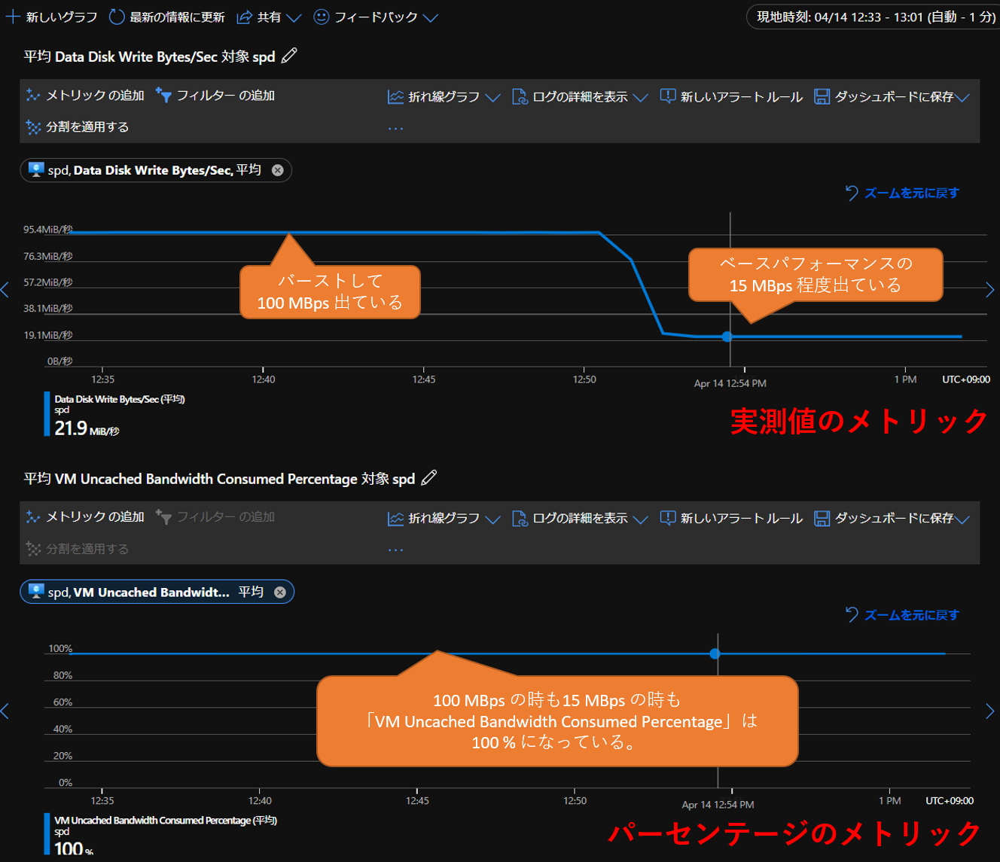
   
上部のメトリックで 100 MBps 出ていたものが途中から約 15 MBps になっているのが確認できます。  
（上記メトリックではベースパフォーマンス 15 Mb㎰ に対し 20 MBps が観測されていますが、このように誤差が現れることがあります。）  
100 MBps でも 15 MBps 付近でも 「VM Uncached Bandwidth Consumed Percentage」は 100 % のままです。  
   
なお、VM レベルの上限に対するメトリックは以下のように、OS ディスク・データディスクで分けられている訳ではなく  

 - キャッシュ有効なディスクに対する上限か？それとも無効なディスクに対する上限か？  
 - MBps の上限か？IOPS の上限か？  

という組み合わせで以下の通り分けられています。  
   
 - メトリック10：キャッシュ有効なディスクに対して VM レベルの MBps のベースパフォーマンスの何 % 出ているか確認  
   - メトリック「VM Cached Bandwidth Consumed Percentage」を選択します。  
  

 - メトリック11：キャッシュ有効なディスクに対して VM レベルの IOSP のベースパフォーマンスの何 % 出ているか確認  
   - メトリック「VM Cached IOPS Consumed Percentage」を選択します。  
  

 - メトリック12：キャッシュが無効なディスクに対して VM レベルの MBps のベースパフォーマンスの何 % 出ているか確認  
   - メトリック「VM Uncached Bandwidth Consumed Percentage」を選択します。  
  

 - メトリック13：キャッシュが無効なディスクに対して VM レベルの IOSP のベースパフォーマンスの何 %出ているか確認  
   - メトリック「VM Uncached IOPS Consumed Percentage」を選択します。  
   
なお、これらのメトリックに関しては以下の点もご注意ください。  
   
■ご参考：ストレージ IO 使用率メトリック  
<https://docs.microsoft.com/ja-jp/azure/virtual-machines/disks-metrics#storage-io-utilization-metrics>  
   
>ーーーーー抜粋ーーーーー  
>Premium ストレージをサポートする VM シリーズ上でのみ使用できます。  
>Ultra ディスクには使用できません。これらの VM シリーズ上の他のディスクの種類には、いずれもこれらのメトリックを使用できます。  
>ーーーーーーーーーーーー  
   
---
# どれくらいの MBps / IOPS が出ているか？  
   
OS ディスクや各 データディスクの Read / Wirte について、何 MBps / IOPS が出ているかをメトリックで確認することができます。  
なお、繰り返しとなりますがこの値は Azure 基盤側で観測した値となりますため、  
OS 内部で観測できた値やドキュメント上の理論値とは差異があることについて、予めご了承ください。  
   
データディスクは必要に応じて LUN でディメンションを分割してください。  
   
 - メトリック14：OS ディスクの Read が何 MBps 出ているか確認  
   - メトリック「OS Disk Read Bytes/Sec」を選択します。  
  

 - メトリック15：OS ディスクの Write が何 MBps 出ているか確認  
   - メトリック「OS Disk Write Bytes/Sec」を選択します。  
  

 - メトリック16：OS ディスクの Read が何 IOPS 出ているか確認  
   - メトリック「OS Disk Read Operations/Sec」を選択します。  
  

 - メトリック17：OS ディスクの Write が何 IOPS 出ているか確認  
   - メトリック「OS Disk Write Operations/Sec」を選択します。  
  

 - メトリック18：データディスクの Read が何 MBps 出ているか確認  
   - メトリック「Data Disk Read Bytes/Sec」を選択します。  
  

 - メトリック19：データディスクの Write が何 MBps 出ているか確認  
   - メトリック「Data Disk Write Bytes/Sec 」を選択します。  
  

 - メトリック20：データディスクの Read が何 IOPS 出ているか確認  
   - メトリック「Data Disk Read Operations/Sec」を選択します。  
  

 - メトリック21：データディスクの Write が何 IOPS 出ているか確認  
   - メトリック「Data Disk Write Operations/Sec」を選択します。  
   
   
   
---
# スロットリングについて  
   
今まで、上限という言葉を使ってディスクの MBps / IOPS の最大値のお話をしてきました。  
では、ゲスト OS からこの上限を超えるようなディスクアクセスがあった場合どうなるのでしょうか。  
   
その場合は、スロットリングが発生します。  
スロットリングとは、上限を超えた分の I/O が遅延して後から実行されるというものとなります。  
図を交えてまずは簡単な例で想像してみましょう。  
   
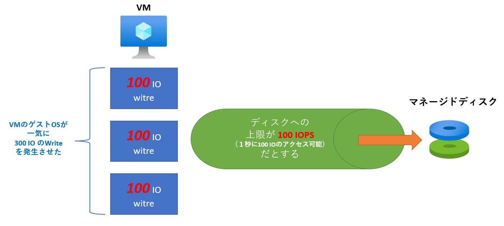
   
上記のように、ディスクへの IOPS の上限が 100 IOPS（つまり、１秒に100 IOのアクセス可能）だった場合を考えましょう。  
VM 上のゲスト OS が一気に 300 IO のディスクへの Write を発生させたとします。  
さあ、どうなるでしょう？  
   
はい。ご推察の通り 3 秒かかります。  
最初の 1 秒では 100 IOPS の Write が処理され、残りの 200 IOPS は処理が待たされる状態です。  
これが、スロットリングの基本的な考え方です。上限を超えた分は次回の処理に回されるという形です。  
（なお後述しますが、実際は 1 秒より細かい時間単位でスロットリングされます。）  
   
Azure では今まで説明をしたように数字として上限値が決められていますが、  
このような I/O が待たされて遅延するといったことは通常のオンプレミス環境のハードディスクでも勿論起きています。  
大量の I/O を処理できないハードディスクに対して、同じように多くの I/O を発生させたら同じように I/O の遅延が起きます。  
そのため、Azure でスロットリングが発生し I/O 遅延が起きることを Azure 特有の現象と思われる方もおりますが、  
通常のオンプレミス環境と同じようなものである点をご理解いただくと良いかと存じます。  
   
また、重要な点として上記の例では 1 秒毎に上限を超えているか判定しスロットリングを行っているような例としましたが、  
実際のこのスロットリングの判定・適用は非常に細かい時間単位で行われております。  
   
そのため、「スロットリングがどの程度起きているか？何回起きているか？発生したことがあるのか？」  
というご質問を受けることがありますが、回数単位での回答は叶いません。  
例えばですが、「CPU使用率が一瞬 0.05 秒だけ 100 % になった！」ということを問題視することは、ほぼ無いものと存じます。  

スロットリングも同じです。  
「一瞬 0.05 秒だけディスクの上限に接触し、スロットリングが 1 回発生した！」というのは、特に問題が無いと考えられるかと思われます。  
   
良い意味で言うと、「スロットリングが発生している」＝「アプリケーションがディスクの能力をちゃんと使い切れている」ということです。  
スロットリングが発生すること自体は問題ではないのです。  
   
一方で、常にスロットリングが発生（ディスクの上限に張り付いている）といった場合は、  
そもそもディスクや VM のサイズが適切でない（足りていない）といったことが考えられます。  
先に説明したメトリック等を用いて、「VM レベルの上限に達しているのか？」「それとも、ディスクレベルの上限に達しているのか？」  
という、ボトルネックを特定して、適切なサイズアップをするのが重要となります。  
   
なお、残念ながらスロットリングの発生自体を直接メトリック等で確認することは叶いません。  
そのため、今まで説明したメトリックを用いて MBps / IOPS が上限値で頭打ちしている場合は、スロットリングが発生していると読み替える必要があります。  
   
他方、先に述べたようにスロットリングは非常に細かい時間単位で行われいますので、  
小さな時間単位でのスロットリングの検知は難しい点をご理解賜れますと幸いです。  
   
重要なのは、「スロットリングが発生しているか？」ではなく、  
「お客様のワークロードに対しパフォーマンスに問題が発生してるか？」です。  
スロットリングが発生していても、パフォーマンスに問題が無い場合は特に対応は不要と考えるのも良いかと存じます。  
   
■ご参考：Throttling  
<https://docs.microsoft.com/ja-jp/azure/virtual-machines/premium-storage-performance#throttling>  
   
---
# 参考となる公開ドキュメントについて
   
今回本記事で解説させていただいた内容は、原則全て公開情報をベースとして記載しております。  
参考となる公開情報について、以下にまとめさせていただきます。  
   
■ご参考: Managed Disks の価格  
<https://azure.microsoft.com/ja-jp/pricing/details/managed-disks/>  
   
■ご参考: Azure マネージド ディスクの概要  
<https://docs.microsoft.com/ja-jp/azure/virtual-machines/managed-disks-overview>  
   
■ご参考: 仮想マシンとディスクのパフォーマンス  
<https://docs.microsoft.com/ja-jp/azure/virtual-machines/disks-performance>  
   
■ご参考: Azure Premium Storage: 高パフォーマンス用に設計する  
<https://docs.microsoft.com/ja-jp/azure/virtual-machines/premium-storage-performance>  
   
■ご参考: マネージド ディスクのバースト  
<https://docs.microsoft.com/ja-jp/azure/virtual-machines/disk-bursting>  
   
■ご参考: ディスク パフォーマンス メトリック  
<https://docs.microsoft.com/ja-jp/azure/virtual-machines/disks-metrics>  
   
---
# さいごに   
非常に長い記事となってしまいましたが、ディスクバーストについて理解することはできましたでしょうか。  
複雑な部分もありますが、クレジットベースのディスクバーストは追加料金不要で、一時的な高負荷に対応できる素晴らしい機能となっております。  
この記事が皆様のディスクバーストの理解の一助となれましたら幸いでございます。
