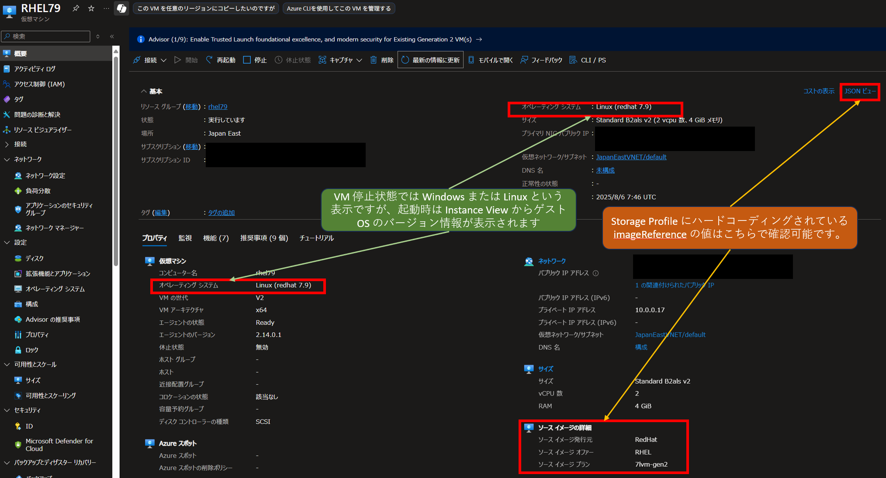
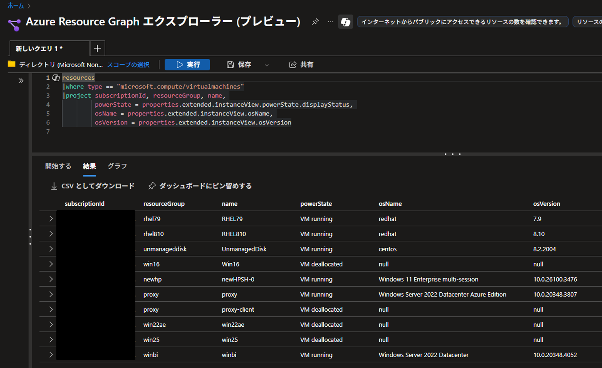

こんにちは、Azure テクニカル サポート チームの富田です。  
Azure VM で実行されているゲスト OS のバージョンを一覧表示を行いたいとのお問い合わせをいただくことがございます。  
実行中の VM の Instance View を取得するコマンドもしくは Azure Resource Graph を使うことで確認可能ですので、この点について解説させていただきます。  

> [!TIP]
> 本件とは直接関連するものではございませんが、VM 作成時に Azure マーケットプレイスにてご希望のイメージバージョンが見つからないといったお問い合わせをいただくことがございます。  
> そのような場合は、Azure CLI などでご希望のイメージがあるか確認をいただけますと幸いです。  
> [https://learn.microsoft.com/ja-jp/azure/virtual-machines/workloads/redhat/redhat-images#view-images-available-in-azure](https://learn.microsoft.com/ja-jp/azure/virtual-machines/workloads/redhat/redhat-images#view-images-available-in-azure)
 
---
## Azure VM にてゲスト OS の情報を確認できる 2 つのソースの解説
 
Azure VM にてゲスト OS の情報を確認できるソースの例として、「Storage Profile」と「Instance View」がございます。  
それぞれ以下の特徴があり、リアルタイムな情報を取得には「Instance View」のご利用が必要でございます。  

### Storage Profile

VM 作成時のイメージの情報が、モデル ビューとして Storage Profile 内の imageReference に publisher, offer, sku として記録されます。  
この情報に OS バージョンの情報が記録されることがございますが、以下の留意点がございます。  

- Azure マーケットプレイス以外から作成された VM では記録されない。
- VM 作成時にハードコーディングされるため、ゲスト OS のバージョンアップを行っても、この値は変化しない。

### Instance View

実行中の VM についての情報を取得できるものとなります。現在実行中のゲスト OS のバージョン情報をリアルタイムに取得できます。  
ゲスト OS のバージョン情報を取得するには、ご利用には以下の点についてご留意ください。  

- VM が起動している必要がある。
- VM エージェントが正常に稼働している必要がある。

■ご参考：Azure Windows VM エージェントの概要  
https://learn.microsoft.com/ja-jp/azure/virtual-machines/extensions/agent-windows
  
■ご参考：Azure Linux VM エージェントの概要  
https://learn.microsoft.com/ja-jp/azure/virtual-machines/extensions/agent-linux

---
## Azure ポータルでの表示

Azure ポータルでは以下ように、VM の概要画面 / VM のオペレーティングシステムの画面 / VM 一覧画面で情報が表示されますが、リアルタイムに現在実行中のゲスト OS 情報を一覧表示するといったことが叶いませんものとなります。  




  


---
## Instance View から実行中の VM のゲスト OS バージョンを一覧取得する例

上記の点を鑑みますと、Azure PowerShell / Azure CLI / Azure Resource Graph を用いて、Instance View から実行中のゲスト OS のバージョン情報を取得することが推奨されます。  
それぞれサンプルをご用意させていただきましたので、ご紹介させていただきます。  

ゲスト OS バージョンの取得には、VM が起動しており、VM エージェントが正常稼働している必要がございます。  
また、スクリプトを実行するユーザーが VM の情報を読み取れる権限が必要となります。  

### PowerShell 環境での Azure PowerShell コマンドの例

サブスクリプション内の VM すべてについて、表形式で出力する Azure PowerShell コマンドの例となります。

```PowerShell
Get-AzVM -Status |  Select-Object -Property ResourceGroupName, Name, PowerState, OsName, OsVersion | Format-Table -AutoSize
```

実行結果の例としては、以下のような表示となります。

```PowerShell
ResourceGroupName Name          PowerState     OsName                                       OsVersion
----------------- ----          ----------     ------                                       ---------
NEWHP             newHPSH-0     VM running     Windows 11 Enterprise multi-session          10.0.26100.3476
PROXY             proxy         VM deallocated
PROXY             proxy-client  VM deallocated
RHEL79            RHEL79        VM running     redhat                                       7.9
RHEL810           RHEL810       VM running     redhat                                       8.10
UNMANAGEDDISK     UnmanagedDisk VM running     centos                                       8.2.2004
WIN16             Win16         VM running     Windows Server 2016 Datacenter               10.0.14393.8330
WIN22AE           win22ae       VM running     Windows Server 2022 Datacenter Azure Edition 10.0.20348.3932
WIN25             win25         VM deallocated
WINBI             winbiVM       VM running     Windows Server 2022 Datacenter               10.0.20348.4052
```

### Bash 環境での Azure CLI コマンドの例

サブスクリプション内の VM すべてについて、JSON 形式で出力する Azure CLI コマンドの例となります。  
Azure CLI の場合、各 VM 毎に Instance View 取得のコマンドを実行するため VM 台数が多い場合はお時間がかかります点、ご留意ください。

```Bash
az vm list --query "[].{VM:id}" -o tsv | xargs -n 1 az vm get-instance-view --query "{VM:id, osName:instanceView.osName, osVersion:instanceView.osVersion}" --id
```

実行結果の例としては、以下のような表示となります。

```Json
{
  "VM": "/subscriptions/aaaaa/resourceGroups/NEWHP/providers/Microsoft.Compute/virtualMachines/testVM",
  "osName": "Windows 11 Enterprise multi-session",
  "osVersion": "10.0.26100.3476"
}
{
  "VM": "/subscriptions/aaaaa/resourceGroups/PROXY/providers/Microsoft.Compute/virtualMachines/deallocatedVM",
  "osName": null,
  "osVersion": null
}
{
  "VM": "/subscriptions/aaaaa/resourceGroups/RHEL79/providers/Microsoft.Compute/virtualMachines/RHEL79",
  "osName": "redhat",
  "osVersion": "7.9"
}
{
  "VM": "/subscriptions/aaaaa/resourceGroups/RHEL810/providers/Microsoft.Compute/virtualMachines/RHEL810",
  "osName": "redhat",
  "osVersion": "8.10"
}
{
  "VM": "/subscriptions/aaaaa/resourceGroups/WINBI/providers/Microsoft.Compute/virtualMachines/WinSV",
  "osName": "Windows Server 2022 Datacenter",
  "osVersion": "10.0.20348.4052"
}
```

### Azure Resource Graph クエリの例

Azure ポータル上の Azure Resource Graph エクスプローラーを用いて、以下のクエリを実行します。  

```KQL
resources
|where type == "microsoft.compute/virtualmachines"
|project subscriptionId, resourceGroup, name, 
         powerState = properties.extended.instanceView.powerState.displayStatus, 
         osName = properties.extended.instanceView.osName, 
         osVersion = properties.extended.instanceView.osVersion
```

■ご参考：クイック スタート: Azure portal を使用して Resource Graph クエリを実行する  
https://learn.microsoft.com/ja-jp/azure/governance/resource-graph/first-query-portal  
  
実行結果の例としては、以下のような表示となります。CSV で結果のエクスポートも可能です。



---
## さいごに

上記コマンドやクエリの詳細な解説が必要な場合や、コマンドをご要件に合わせて改修したい場合、Microsoft Copilot を利用することもおすすめです。  
私自身もよく、以下のようなプロンプトを使用して活用しております。  

- 以下のコマンドは何をしているのか解説してください。
- 以下のコマンドについて、○○の情報を表示するように改修してください。

生成された回答は必ず正しいとは限りませんので、検証等をいただく必要がございますが、Microsoft Copilot といった AI を用いて色々なことができる便利な時代になりました。  
これらの情報が皆様のお役に立てれば幸いでございます。
